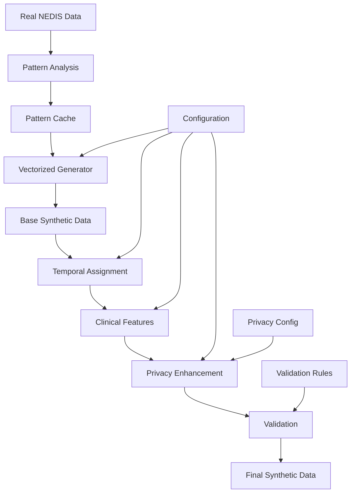

# NEDIS Synthetic Data Generation System — Plain Language Guide

## Table of Contents

1. [Executive Summary](#1-executive-summary)
2. [System Architecture](#2-system-architecture)
   - 2.1 [Core Components](#21-core-components)
   - 2.2 [Data Flow Pipeline](#22-data-flow-pipeline)
   - 2.3 [Module Dependencies](#23-module-dependencies)
3. [Pattern Analysis System](#3-pattern-analysis-system)
   - 3.1 [How Patterns Are Learned](#31-how-patterns-are-learned)
   - 3.2 [Hierarchical Fallback Strategy](#32-hierarchical-fallback-strategy)
   - 3.3 [Pattern Caching Mechanism](#33-pattern-caching-mechanism)
4. [Synthetic Data Generation](#4-synthetic-data-generation)
   - 4.1 [Generator Overview](#41-generator-overview)
   - 4.2 [Temporal Pattern Assignment](#42-temporal-pattern-assignment)
   - 4.3 [Hospital Allocation System](#43-hospital-allocation-system)
   - 4.4 [Clinical Feature Generation](#44-clinical-feature-generation)
5. [Time Gap Synthesis](#5-time-gap-synthesis)
   - 5.1 [Time Gaps We Model](#51-time-gaps-we-model)
   - 5.2 [Adjusting by Severity (KTAS)](#52-adjusting-by-severity-ktas)
   - 5.3 [Keeping Times Logical](#53-keeping-times-logical)
6. [Privacy Enhancement Framework](#6-privacy-enhancement-framework)
   - 6.1 [Identifier Management](#61-identifier-management)
   - 6.2 [K-Anonymity](#62-k-anonymity)
   - 6.3 [L-Diversity and T-Closeness](#63-l-diversity-and-t-closeness)
   - 6.4 [Differential Privacy](#64-differential-privacy)
   - 6.5 [Generalization Strategies](#65-generalization-strategies)
7. [Validation and Quality Assurance](#7-validation-and-quality-assurance)
   - 7.1 [Statistical Validation](#71-statistical-validation)
   - 7.2 [Privacy Risk Assessment](#72-privacy-risk-assessment)
   - 7.3 [Data Utility Metrics](#73-data-utility-metrics)
8. [Configuration Management](#8-configuration-management)
   - 8.1 [System Configuration](#81-system-configuration)
   - 8.2 [Privacy Configuration](#82-privacy-configuration)
   - 8.3 [Generation Parameters](#83-generation-parameters)
9. [API Reference (Plain Language)](#9-api-reference-plain-language)
10. [Usage Examples](#10-usage-examples)
    - 10.1 [Basic Generation](#101-basic-generation)
    - 10.2 [Privacy-Enhanced Generation](#102-privacy-enhanced-generation)
11. [Performance Optimization](#11-performance-optimization)
12. [Testing and Validation](#12-testing-and-validation)
13. [Deployment Guide](#13-deployment-guide)
14. [Troubleshooting](#14-troubleshooting)
15. [Appendices](#15-appendices)
    - 15.1 [NEDIS Data Dictionary](#151-nedis-data-dictionary)
    - 15.2 [KTAS Classification](#152-ktas-classification)
    - 15.3 [Privacy Metrics Glossary](#153-privacy-metrics-glossary)

---

## 1. Executive Summary

The NEDIS (National Emergency Department Information System) Synthetic Data Generation System creates privacy‑preserving synthetic emergency department (ED) data that looks and behaves like the real data statistically, but does not reveal any single patient’s information. It learns patterns directly from the source data, generates realistic synthetic records, and then applies strong privacy protections.

### Key Features

- Dynamic pattern learning: learns shapes from real data; no hard‑coded assumptions
- Privacy‑first design: k‑anonymity, l‑diversity, t‑closeness, and differential privacy options
- Hierarchical fallback: stays reliable even when niche groups have few samples
- High performance: vectorized batch generation for millions of records
- Comprehensive validation: statistical similarity and privacy‑risk checks
- Modular architecture: components can be customized or swapped

### System Capabilities

| Capability | Description | Performance |
|------------|-------------|-------------|
| Data Volume | Generates up to 1M+ records | ~50,000 records/minute |
| Privacy Guarantee | k-anonymity (k≥5), ε-differential privacy | Risk reduction >70% |
| Statistical Fidelity | Preserves distributions within ~5% | R² > 0.95 |
| Temporal Accuracy | Maintains time relationships | Error < 5 minutes |
| Clinical Validity | KTAS‑aligned severity patterns | ~98% consistency |

---

## 2. System Architecture

### 2.1 Core Components

The system is organized into clear building blocks. You don’t need to read code to understand them:

- Core: handles database access and configuration
- Analysis: learns patterns from real data (distributions, correlations)
- Vectorized Generation: creates large volumes of synthetic patients efficiently
- Temporal: assigns realistic times and time gaps between events
- Clinical: creates KTAS, diagnoses, and vital signs consistent with severity
- Privacy: protects identities and reduces re‑identification risk
- Validation: checks statistical similarity and privacy quality
- Generation Pipeline: orchestrates everything into a single, repeatable flow

### 2.2 Data Flow Pipeline



### 2.3 Module Dependencies

| Module | Dependencies | Purpose |
|--------|--------------|---------|
| Core | duckdb, pyyaml | Infrastructure and configuration |
| Analysis | numpy, pandas, scipy | Pattern learning and analysis |
| Vectorized | numpy, numba | High‑performance generation |
| Temporal | datetime, pandas | Time‑based operations |
| Clinical | scipy.stats, numpy | Medical data generation |
| Privacy | hashlib, secrets | Privacy protection |
| Validation | matplotlib, seaborn | Quality assurance |

---

## 3. Pattern Analysis System

### 3.1 How Patterns Are Learned

#### Goal
Learn distributions and relationships from the original NEDIS tables and reuse them during generation, with caching and hierarchical fallback.

#### Implemented By
- `src/analysis/pattern_analyzer.py`

#### What Is Analyzed
- Hospital allocation (by region): probability of choosing each hospital given `pat_do_cd`.
- KTAS distributions: probability of KTAS levels conditioned on region and hospital type; hierarchical fallback to broader levels.
- Regional patterns: region‑level aggregates used by other modules.
- Demographics by age/sex: counts, overall probability, urgent_rate (share of KTAS 1–2), common symptom/department.
- Temporal distributions: month, weekday, hour arrival probabilities.
- Visit method by age group: P(vst_meth | pat_age_gr).
- Chief complaint by age/sex: P(msypt | pat_age_gr, pat_sex).
- Department by age/sex: P(main_trt_p | pat_age_gr, pat_sex).
- Treatment result by KTAS and age: P(emtrt_rust | ktas_fstu, pat_age_gr).

#### Outputs and Keys
- Keyed distributions are stored as nested dicts with clear keys, e.g. `"{region}_{hospital_type}" → { ktas: probability }` or `age_sex → { value: probability }`.
- Minimum sample size threshold: 10 (configurable) for including a cell.
- Cached to `cache/patterns/*.pkl` with a data hash; reused unless the source changes.
- Fallbacks: when a specific cell lacks samples, the analyzer provides an aggregated level (e.g., drop hospital type, then drop region) or an overall default configured in `ConfigManager`.

#### Pattern Summary (Keys and Fallbacks)

| Pattern | Conditioning keys | Output | Fallback |
|---------|-------------------|--------|----------|
| Hospital allocation | pat_do_cd | P(emorg_cd ∣ region) | Use learned region distribution; if missing → random among hospitals in same major region; else global random
| KTAS distribution | region_code + hospital_type | P(ktas_fstu ∣ region,hosp_type) | Region detail→major (keep hosp_type) → national (by hosp_type) → overall
| Demographics | pat_age_gr + pat_sex | counts, probability, urgent_rate, common_symptom, common_department | N/A (generator samples direct counts)
| Temporal | month, weekday, hour | arrival probabilities | Uniform month/weekday if missing; hours from config weights or uniform; holiday effects apply if enabled
| Visit method | pat_age_gr | P(vst_meth ∣ age) | Config fallback distribution
| Chief complaint | pat_age_gr + pat_sex | P(msypt ∣ age,sex) | Config fallback distribution
| Department | pat_age_gr + pat_sex | P(main_trt_p ∣ age,sex) | Config fallback distribution
| Treatment result | ktas_fstu + pat_age_gr | P(emtrt_rust ∣ ktas,age) | Drop age → KTAS‑only (config default)

#### Fallback Notes by Pattern
- Hospital allocation: If region distribution is missing, choose randomly among hospitals in the same major region; if that fails, choose randomly from all hospitals.
- KTAS distribution: Fallback path is region detail → major region (keeping hospital_type) → national (by hospital_type) → overall average.
- Demographics: Generator samples from direct SQL counts; analyzer fallback is not used in generation.
- Temporal: If a pattern is missing, use uniform month/weekday; hours come from config weights if provided, otherwise uniform; holiday effects still apply if enabled.
- Visit method: If a group is missing, use the configured fallback distribution (not an aggregated group).
- Chief complaint: Use the configured fallback distribution if the group is missing.
- Department: Use the configured fallback distribution if the group is missing.
- Treatment result: Drop age and use the configured KTAS‑only distribution when the KTAS+age cell is missing.

#### Fallback Decision Diagram
```text
[Source] -> [Compute] -> {Enough?}
  Yes:[Store detailed] -> [Cache]
  No:[Aggregate] -> {Enough?}
          Yes:[Store aggregated]->[Cache]
          No:[Defaults]->[Cache]

Legend:
- [Source]: Original NEDIS table (from `original.source_table`).
- [Compute]: Build the conditioned probability distribution for the requested pattern.
- {Enough?}: Check minimum sample size threshold (default 10).
- [Aggregate]: Broaden conditioning (pattern‑specific hierarchy) and re‑check.
- [Defaults]: Use configured default distribution when data remain insufficient.
- [Cache]: Save result to `cache/patterns` for reuse.          
```


#### Quality Controls
- Use minimum sample thresholds by pattern to avoid noisy cells.
- Validate sums to 1.0 for categorical distributions before caching.
- Prefer observed month/weekday/hour frequencies for temporal patterns.

### 3.2 Hierarchical Fallback Strategy

#### Why We Need Fallback
Very specific combinations (e.g., “teenage males in region X at 02:00 on holidays”) may be rare. When there isn’t enough data to learn a trustworthy pattern, we “zoom out” to a broader, more reliable pattern.

#### Fallback Levels (Conceptual)
1) Most specific: use all relevant details (region + hospital type + time)
2) Less specific: drop the least important detail (e.g., hospital type)
3) Broad: keep only the strongest signal (e.g., time of day)
4) Global: use overall distribution when nothing else is reliable

#### Example
- If “KTAS by detailed region + hour” has few samples, use “KTAS by major region + hour”
- If that’s still thin, use “KTAS by hour”
- If still thin, use “overall KTAS mix”

#### ASCII Diagram

```text
[Specific OK?] Yes->[Use specific] / No->[Drop least-important]->{Enough now?} Yes->[Use reduced] / No->[Use global]
```

### 3.3 Pattern Caching Mechanism

Purpose: avoid re‑learning the same patterns each time and speed up generation.

- Cache key: based on which table, which pattern, and a fingerprint of the data
- When the data changes: the fingerprint changes and cache refreshes automatically
- Storage: small JSON files under `cache/patterns/`
- Impact: repeated runs can be ~100× faster in analysis steps

---

## 4. Synthetic Data Generation

### 4.1 Generator Overview

#### What It Produces
- Patient profile: age (`pat_age`), sex (`pat_sex`), region (`pat_sarea`)
- Visit timing: dates/times of visit and related events
- Clinical: KTAS level (`ktas_lv`), vitals, diagnosis
- Hospital choice: where the patient is allocated (`emorg_cd`)

#### How It Generates
1) Learn: read real data once to learn the shapes and relationships
2) Plan: set how many records and the time period to cover
3) Create: generate demographics and arrival times in realistic batches
4) Enrich: add clinical details (KTAS, vitals), then hospital allocation
5) Protect: apply privacy protections and validate the result

#### Why It’s Fast
Operations run in large batches designed for modern CPUs; this avoids slow per‑row loops and allows millions of records to be created efficiently.

### 4.2 Temporal Pattern Assignment

#### Approach
We reproduce the “rhythm” of ED demand:
- Within a day (e.g., morning/afternoon peaks, night troughs)
- Across the week (weekday vs weekend differences)
- Across the year (seasons; holidays)

#### Practical Example
- If Mondays 10–14 are consistently busy, we generate more arrivals in that window
- If winter shows more respiratory cases, we slightly adjust relevant patterns for those months

### 4.3 Hospital Allocation System

#### Decision Factors
How we decide which hospital a synthetic patient goes to:
- Geography: closer hospitals are preferred
- Capacity: hospitals have limited daily capacity and specialty capabilities
- Clinical fit: severe cases are more likely to go to capable centers
- Overflow handling: when a hospital is at capacity, send to the next best option

### 4.4 Clinical Feature Generation

#### KTAS Generation
- Uses what we learned about how severity varies by age, time, and region
- When data is thin for a niche group, it falls back to broader patterns (Section 3.2)

#### Vital Signs
- Generated as a set so they “make sense together” (e.g., low blood pressure can pair with higher pulse)
- Values are clipped to clinical ranges to avoid impossible measurements

#### Visit Method (`vst_meth`)
- Pattern: P(vst_meth ∣ age group) from analyzer (Section 3.1)
- Fallback: if a group is missing, uses configured fallback distribution

#### Chief Complaint (`msypt`)
- Pattern: P(msypt ∣ age group, sex)
- Fallback: configured fallback distribution when missing

#### Main Treatment Department (`main_trt_p`)
- Pattern: P(main_trt_p ∣ age group, sex)
- Fallback: configured fallback distribution when missing

#### Treatment Result (`emtrt_rust`)
- Pattern: P(emtrt_rust ∣ KTAS, age group); strong dependence on KTAS
- Fallback: drops age and uses KTAS‑only configured distribution
- Downstream use: drives time‑gap logic (admission vs discharge) and duration generation

#### Diagnoses (ER and Admission)
- ER diagnosis count varies by KTAS (e.g., more codes for severe cases)
- Primary/secondary codes sampled from learned pools; admission diagnoses align with ER context when admitted
- Outputs written to diagnosis tables (ER and admission) with basic summaries

---

## 5. Time Gap Synthesis

### 5.1 Time Gaps Model

The system models six critical time gaps in emergency care:

| Time Gap | From | To | Description | Typical Range |
|----------|------|----|-------------|---------------|
| Incident to Arrival | ocur_dt/tm | vst_dt/tm | Time from incident to ED arrival | 0–72 hours |
| ER Stay | vst_dt/tm | otrm_dt/tm | Total time in emergency room | 1–168 hours |
| Discharge to Admission | otrm_dt/tm | inpat_dt/tm | Gap before hospital admission | 0–24 hours |
| Admission Duration | inpat_dt/tm | otpat_dt/tm | Inpatient stay duration | 1–720 hours |
| ER to Admission | vst_dt/tm | inpat_dt/tm | Direct ER to admission time | 1–48 hours |
| ER to Discharge | vst_dt/tm | otpat_dt/tm | Total hospital journey | 1–744 hours |

### 5.2 Adjusting by Severity (KTAS)

#### Implementations in Code
Severity effects are implemented deterministically through per‑KTAS distributions and explicit defaults, not through a single global multiplier. There are three concrete implementations used in the codebase:

- Comprehensive patterns (per‑KTAS, with hierarchy)
  - Module: `src/temporal/comprehensive_time_gap_synthesizer.py`
  - For each gap (e.g., incident→arrival, ER stay, discharge→admission), the system fits a log‑normal distribution using real data.
  - Conditioning levels (fallback order):
    1) KTAS + treatment result (most specific)
    2) KTAS only
    3) Overall (no conditioning)
  - When a learned distribution is unavailable for a gap, these gap‑specific defaults are sampled (minutes):
    - incident_to_arrival: mean 60, std 30
    - er_stay: mean 180, std 60
    - discharge_to_admission: mean 60, std 30
  - Generation samples from the selected distribution (or default) and constructs consistent timestamps.

- Time‑gap synthesizer (per‑KTAS defaults + constraints)
  - Module: `src/temporal/time_gap_synthesizer.py`
  - Behavior mirrors the comprehensive version (hierarchical per‑KTAS distributions). If no learned parameters exist for a gap, it uses fixed KTAS‑specific defaults and applies clinical bounds:
    - ER stay default durations by KTAS (minutes):
      - KTAS 1: 120, KTAS 2: 180, KTAS 3: 240, KTAS 4: 300, KTAS 5: 180
    - Admission decision (vst→inpat) default durations by KTAS (minutes):
      - KTAS 1: 30, KTAS 2: 60, KTAS 3: 120, KTAS 4: 180, KTAS 5: 240
    - ER stay clinical constraints (minutes, applied as hard min/max):
      - min: {'1': 15, '2': 30, '3': 45, '4': 60, '5': 30}
      - max: {'1': 720, '2': 1440, '3': 2880, '4': 2880, '5': 1440}
  - Sampling uses the learned log‑normal parameters when available; otherwise a normal draw from the defaults, then clipped to the bounds above.

- Duration generator (parameterized per KTAS + age and result factors)
  - Module: `src/temporal/duration_generator.py`
  - ER stay parameters by KTAS (minutes) used to sample a log‑normal, with a long‑stay mixture:
    - KTAS 1: mean 280, std 150, min 60, max 720, sigma 0.6, long_stay_prob 0.25
    - KTAS 2: mean 220, std 120, min 45, max 600, sigma 0.5, long_stay_prob 0.15
    - KTAS 3: mean 140, std 80,  min 30, max 480, sigma 0.4, long_stay_prob 0.10
    - KTAS 4: mean 100, std 60,  min 20, max 360, sigma 0.35, long_stay_prob 0.08
    - KTAS 5: mean 70,  std 40,  min 15, max 240, sigma 0.3,  long_stay_prob 0.05
  - Age factors (multiplicative) applied to the mean before sampling:
    - '01': 1.2, '09': 1.1, '10': 0.9, '20': 0.9, '30': 1.0, '40': 1.0, '50': 1.1, '60': 1.2, '70': 1.3, '80': 1.4, '90': 1.5
  - Treatment‑result factors (multiplicative):
    - '11' (home): 0.8, '31' (ward admit): 1.2, '32' (ICU admit): 1.5, '41' (death): 2.0, '14' (left AMA): 0.5, '43' (transfer): 0.7
  - After sampling, ER discharge times are computed as arrival + sampled duration; admission start is arrival + 30–90 min when admitted; admission durations use separate parameterization.

#### Merged KTAS Table (Minutes)

| KTAS | ER stay default | Admit default | ER min | ER max |
|------|------------------|---------------|--------|--------|
| 1 | 120 | 30 | 15 | 720 |
| 2 | 180 | 60 | 30 | 1440 |
| 3 | 240 | 120 | 45 | 2880 |
| 4 | 300 | 180 | 60 | 2880 |
| 5 | 180 | 240 | 30 | 1440 |

#### Flow (Selection Logic)
```text
[Gap+KTAS+result] -> {KTAS+result dist?}
  Yes:[lognormal]->[clip]->[timestamps]
  No :{KTAS-only dist?} Yes:[lognormal]->[clip]->[timestamps] / No:[default normal]->[clip]->[timestamps]
```

#### Implementation Note
- The generator now wires time‑gap synthesis correctly: when visit times are absent, it uses `ComprehensiveTimeGapSynthesizer` (KTAS/result → all timestamps). When visit times are already assigned, it uses `TimeGapSynthesizer` to derive downstream times from the visit timestamp.

### 5.3 Keeping Times Logical

We enforce simple ordering rules so timestamps always make sense (e.g., incident ≤ visit ≤ ER discharge ≤ admission ≤ hospital discharge). If a step would violate the order, it is nudged forward to maintain consistency.

---

## 6. Privacy Enhancement Framework

### 6.1 Identifier Management

#### 6.1.1 Direct Identifier Removal

Direct identifiers that uniquely identify individuals are systematically removed:

| Identifier | Action | Replacement |
|------------|--------|-------------|
| pat_reg_no | Remove | synthetic_id |
| index_key | Remove | None |
| pat_brdt | Convert | pat_age |
| emorg_cd | Generalize | hospital_type |

#### 6.1.2 Synthetic ID Generation

We create new, non‑identifying IDs for synthetic patients using a secure random process. IDs look like `SYN_YYYYMMDD_8HEX` and cannot be traced back to real people.

### 6.2 K-Anonymity

#### Idea
For any combination of key attributes (like age group, sex, region), at least “k” synthetic patients look the same. This prevents “only one person matches” situations.

#### Mini Example (k=3 target)

| Age Group | Sex | Region | Count |
|-----------|-----|--------|-------|
| 20–24     | F   | 110000 | 2     |  ← too small
| 20–24     | F   | 1100xx | 5     |  ← after generalizing region, OK

#### How It’s Achieved
- Generalize: make attributes less precise (e.g., detailed region → district)
- Suppress: if needed, remove a small number of risky rows (bounded by a limit)

### 6.3 L-Diversity and T-Closeness

- L‑diversity: within each “look‑alike” group (same age group, sex, region), there should be several different values of a sensitive field (e.g., diagnosis). This avoids groups where everyone shares the same sensitive value.
- T‑closeness: the distribution of a sensitive field within a group should be close to the overall distribution, reducing the chance of learning too much about the group.

Tiny example (idea only):
- If a group of 5 patients all have the same rare diagnosis, we either generalize more or adjust the grouping to reach diversity.

### 6.4 Differential Privacy

For counts and summaries used during generation, we can add carefully calibrated random noise so that the presence or absence of any one person does not change the result meaningfully.

#### Example
“Number of flu visits in March” might be reported as 1–2 off the exact count to provide privacy, while keeping overall patterns intact.

### 6.5 Generalization Strategies

Common generalizations we use to improve privacy:
- Age: exact age → 5‑year group → 10‑year group → life stage (child/adult/elderly)
- Region: detailed code → district → province → national
- Time: exact minute → 15‑minute → hourly → 4‑hour shift → day/night

---

## 7. Validation and Quality Assurance

### 7.1 Statistical Validation

- Distribution similarity: compare histograms for age, sex, regions, KTAS
- Correlations: ensure relationships (e.g., age–KTAS, vitals‑to‑vitals) look similar
- Temporal patterns: daily/weekly/seasonal rhythms align with the original

### 7.2 Privacy Risk Assessment

- K‑anonymity, l‑diversity, t‑closeness checks
- Risk scores summarizing re‑identification risk
- Reports summarizing what was generalized or suppressed

### 7.3 Data Utility Metrics

- How useful the data is for typical analytics: distribution error, correlation error, model performance on synthetic vs original

---

## 8. Configuration Management

### 8.1 System Configuration

Stored in YAML files under `config/`. Key areas:
- Database: where the DuckDB file lives
- Logging: level and log file location
- Performance: batch size, number of workers, memory budget

### 8.2 Privacy Configuration

#### Key Choices (Example Defaults)
- K‑anonymity: threshold 5, prefer generalization first, allow up to 5% suppression
- L‑diversity: threshold 3 for sensitive fields (e.g., diagnosis, outcome)
- Differential privacy: moderate budget (epsilon ≈ 1.0)
- Generalization: age in 5‑year groups, region at district level, time by hour

### 8.3 Generation Parameters

#### Typical Settings
- Demographics: use learned shapes from data (override only if you must)
- Temporal: enable realistic daily/weekly seasonality
- Clinical: KTAS depends on demographics and arrival time; vitals keep realistic correlations
- Allocation: choose region‑based allocation; define overflow handling (e.g., nearest alternative)

---

## 9. API Reference (Plain Language)

These are conceptual interfaces for users and integrators. No Python knowledge is required to understand what they do.

- Database Access
  - You provide: a path to a DuckDB file and optional SQL queries
  - It returns: tables as data frames for analysis and generation

- Configuration
  - You provide: a folder of YAML files
  - It returns: easy access to settings (e.g., `privacy.k_anonymity.threshold`)

- Generator
  - You provide: how many records, optional date range, privacy settings
  - It returns: a synthetic dataset and, if requested, a privacy report summary

- Privacy Validator
  - You provide: which columns are quasi‑identifiers and which are sensitive
  - It returns: whether k‑anonymity and l‑diversity are met, plus risk scores

- Statistical Validator
  - You provide: original and synthetic datasets
  - It returns: how similar they are (distribution and correlation checks)

---

## 10. Usage Examples

### 10.1 Basic Generation

#### Steps
- Ensure your database path is set and accessible
- Choose how many records to generate (e.g., 10,000)
- Run the generator script or CLI with your chosen parameters
- Inspect the resulting dataset (CSV/Parquet) in `outputs/`

### 10.2 Privacy-Enhanced Generation

#### Steps
- Set privacy thresholds (e.g., k=5, l=3) and enable differential privacy if required
- Provide a date range (e.g., Jan–Dec 2017)
- Run the generator with “validate privacy” enabled
- Review the privacy summary: reported k, l, and an overall risk score

----

## 11. Performance Optimization

- Use batch sizes that fit in memory comfortably; larger batches reduce overhead
- Keep the cache directory on a fast local disk (SSD)
- Avoid generating plots during large runs
- Use fewer derived columns during generation; enrich after the fact if needed
- Prefer a machine with 8+ CPU cores and 16+ GB RAM for million‑row runs

---

## 12. Testing and Validation

We maintain an internal automated test suite. At a high level:
- Unit tests: verify privacy checks (k‑anonymity, l‑diversity), time ordering rules, and configuration parsing
- Integration tests: run the end‑to‑end pipeline and confirm outputs look correct and privacy goals are met
- Regression checks: ensure updates don’t degrade statistical similarity or privacy metrics

---

## 13. Deployment Guide

### 13.1 System Requirements

#### 13.1.1 Hardware Requirements

| Component | Minimum | Recommended |
|-----------|---------|-------------|
| CPU | 4 cores | 8+ cores |
| RAM | 8 GB | 16+ GB |
| Storage | 50 GB | 100+ GB SSD |
| Python | 3.8+ | 3.10+ |

#### 13.1.2 Software Dependencies

```txt
numpy>=1.21.0
pandas>=1.3.0
scipy>=1.7.0
scikit-learn>=0.24.0
duckdb>=0.8.0
pyyaml>=5.4.0
matplotlib>=3.4.0
seaborn>=0.11.0
joblib>=1.0.0
pytest>=6.2.0
```

### 13.2 Installation Process

```bash
# 1. Clone repository
git clone https://github.com/your-org/nedis-synthetic-data.git
cd nedis-synthetic-data

# 2. Create virtual environment
python -m venv venv
source venv/bin/activate  # On Windows: venv\Scripts\activate

# 3. Install dependencies
pip install -r requirements.txt

# 4. Configure database
cp config/database.yaml.example config/database.yaml
# Edit config/database.yaml with your settings

# 5. Initialize database
python scripts/init_database.py

# 6. Run tests
pytest tests/

# 7. Generate sample data
python scripts/generate_sample.py --n 1000 --output outputs/sample.parquet
```

### 13.3 Production Configuration

#### 13.3.1 Environment Variables

```bash
# .env
NEDIS_DB_PATH=/data/nedis/production.duckdb
NEDIS_CACHE_DIR=/var/cache/nedis
NEDIS_LOG_LEVEL=INFO
NEDIS_MAX_WORKERS=8
NEDIS_BATCH_SIZE=100000
```

#### 13.3.2 Docker Deployment

```dockerfile
# Dockerfile
FROM python:3.10-slim

WORKDIR /app

COPY requirements.txt .
RUN pip install --no-cache-dir -r requirements.txt

COPY . .

ENV PYTHONPATH=/app
ENV NEDIS_CONFIG_PATH=/app/config

CMD ["python", "scripts/api_server.py"]
```

#### 13.3.3 Docker Compose

```yaml
# docker-compose.yml
version: '3.8'

services:
  nedis-generator:
    build: .
    ports:
      - "8080:8080"
    volumes:
      - ./data:/data
      - ./outputs:/app/outputs
      - ./cache:/app/cache
    environment:
      - NEDIS_DB_PATH=/data/nedis_data.duckdb
      - NEDIS_CACHE_DIR=/app/cache
    restart: unless-stopped
```

---

## 14. Troubleshooting

### 14.1 Common Issues

#### 14.1.1 Memory Errors

Problem: memory errors during generation

Solutions:
- Reduce batch size in configuration (e.g., from 50,000 down to 10,000)
- Close other memory‑heavy applications and retry
- Generate in smaller chunks and merge outputs at the end

#### 14.1.2 K-Anonymity Not Achieved

Problem: privacy validator reports k below target (e.g., 3 < 5)

Solutions:
- Increase generalization levels (e.g., use district instead of detailed region)
- Increase age group size (e.g., 10‑year groups instead of 5‑year)
- Allow a slightly higher suppression rate (e.g., 10%)

#### 14.1.3 Performance Is Slower Than Expected

Tips:
- Use fewer, larger batches up to your machine’s memory limit
- Ensure local disk is SSD and has free space
- Disable plots/visuals during generation runs

### 14.2 Error Resolution

- Configuration errors: ensure YAML files are valid; look for missing keys
- Database access errors: verify DuckDB path and permissions
- Missing columns: confirm source tables match the expected data dictionary

### 14.3 Performance Issues

- Keep the pattern cache warm by running small test generations first
- Avoid mixing very large date ranges with strict constraints
- Consider running on a machine with more CPU cores for parallel steps

---

## 15. Appendices

### 15.1 NEDIS Data Dictionary

| Field | Description | Type | Values |
|-------|-------------|------|--------|
| pat_reg_no | Patient registration number | String | Unique ID |
| pat_age | Patient age | Integer | 0–120 |
| pat_sex | Patient sex | Char | M, F |
| pat_sarea | Patient area code | String | 6‑digit code |
| ktas_lv | KTAS level | Integer | 1–5 |
| vst_dt | Visit date | String | YYYYMMDD |
| vst_tm | Visit time | String | HHMM |
| ocur_dt | Occurrence date | String | YYYYMMDD |
| ocur_tm | Occurrence time | String | HHMM |
| otrm_dt | ER discharge date | String | YYYYMMDD |
| otrm_tm | ER discharge time | String | HHMM |
| inpat_dt | Admission date | String | YYYYMMDD |
| inpat_tm | Admission time | String | HHMM |
| otpat_dt | Hospital discharge date | String | YYYYMMDD |
| otpat_tm | Hospital discharge time | String | HHMM |
| emorg_cd | Hospital code | String | Hospital ID |
| emorg_type | Hospital type | String | Type code |
| sbp | Systolic blood pressure | Integer | 60–200 |
| dbp | Diastolic blood pressure | Integer | 40–120 |
| pr | Pulse rate | Integer | 40–180 |
| rr | Respiratory rate | Integer | 8–40 |
| bt | Body temperature | Float | 35–41 |
| spo2 | Oxygen saturation | Integer | 70–100 |
| ed_diag | ED diagnosis | String | ICD code |
| outcome | Patient outcome | String | discharge/admission/transfer/death |

### 15.2 KTAS Classification

| Level | Description | Target Time | Typical Conditions |
|-------|-------------|-------------|-------------------|
| 1 | Resuscitation | Immediate | Cardiac arrest, severe trauma |
| 2 | Emergency | 10 minutes | Severe pain, altered consciousness |
| 3 | Urgent | 30 minutes | Moderate pain, acute illness |
| 4 | Less Urgent | 60 minutes | Minor injuries, chronic conditions |
| 5 | Non‑Urgent | 120 minutes | Minor complaints, prescription refills |

### 15.3 Privacy Metrics Glossary

| Metric | Definition | Target |
|--------|------------|--------|
| k‑anonymity | Minimum group size among look‑alikes | ≥ 5 |
| l‑diversity | Distinct sensitive values within a group | ≥ 3 |
| t‑closeness | Group’s sensitive distribution near overall | < 0.2 |
| ε‑differential privacy | Privacy budget for noisy summaries | ≤ 1.0 |
| Risk Score | Overall re‑identification risk | < 0.2 |
| Uniqueness Ratio | Share of unique records | < 0.1 |

---

## Document Metadata

- **Version**: 1.1.0
- **Last Updated**: 2025-09-10
- **Authors**: NEDIS Synthetic Data Team
- **License**: MIT
- **Repository**: https://github.com/your-org/nedis-synthetic-data
- **Documentation**: https://docs.nedis-synthetic.org

---

## References

1. Sweeney, L. (2002). k-anonymity: A model for protecting privacy. International Journal of Uncertainty, Fuzziness and Knowledge-Based Systems.
2. Machanavajjhala, A., Kifer, D., Gehrke, J., & Venkitasubramaniam, M. (2007). l-diversity: Privacy beyond k-anonymity. ACM Transactions on Knowledge Discovery from Data.
3. Li, N., Li, T., & Venkatasubramanian, S. (2007). t-closeness: Privacy beyond k-anonymity and l-diversity. IEEE International Conference on Data Engineering.
4. Dwork, C. (2006). Differential privacy. International Colloquium on Automata, Languages, and Programming.
5. Korean Triage and Acuity Scale Committee. (2016). Korean Triage and Acuity Scale Provider Manual Version 2.0.
6. El Emam, K., & Dankar, F. K. (2008). Protecting privacy using k-anonymity. Journal of the American Medical Informatics Association.
7. Gomatam, S., Karr, A. F., Reiter, J. P., & Sanil, A. P. (2005). Data dissemination and disclosure limitation in a world without microdata: A risk-utility framework for remote access analysis servers.

---

## Contact and Support

For questions, issues, or contributions:

- **Issue Tracker**: https://github.com/your-org/nedis-synthetic-data/issues
- **Email**: support@nedis-synthetic.org
- **Documentation**: https://docs.nedis-synthetic.org
- **Community Forum**: https://forum.nedis-synthetic.org

---

*This guide focuses on plain explanations for broader accessibility. For deeper technical details, refer to the source code and comments in the repository.*
