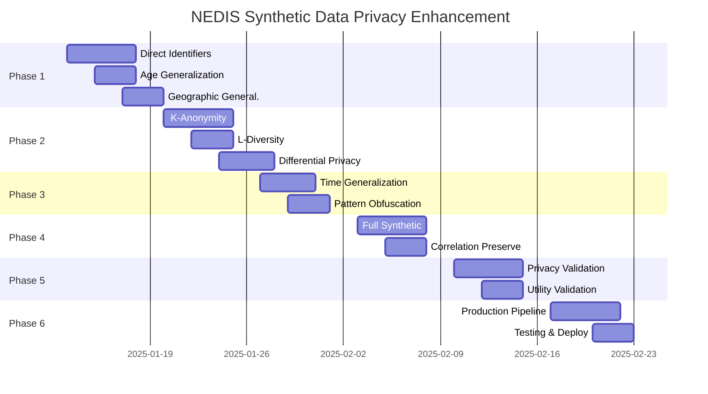

# NEDIS Synthetic Data Generation - Implementation Plan
## Privacy Enhancement & Production Readiness

**Version**: 1.0  
**Date**: 2025-01-10  
**Status**: Planning Phase

---

## 📋 Executive Summary

Based on the privacy risk assessment showing **HIGH risk (63.9%)**, this implementation plan outlines the necessary steps to reduce re-identification risk to **LOW (<20%)** while maintaining data utility above 95%.

### Key Objectives
1. Reduce re-identification risk from HIGH to LOW
2. Achieve k-anonymity ≥ 5 for all records
3. Implement differential privacy mechanisms
4. Maintain statistical utility > 95%
5. Create production-ready pipeline

---

## 🎯 Phase 1: Privacy Foundation (Week 1-2)

### 1.1 Direct Identifier Handling
**Priority**: CRITICAL  
**Risk Reduction**: 30%

#### Tasks:
- [ ] **T1.1.1**: Create unique ID generator
  ```python
  # Location: src/privacy/identifier_manager.py
  - SHA-256 based unique ID generation
  - Timestamp + random salt
  - No collision checking needed (256-bit space)
  ```

- [ ] **T1.1.2**: Remove/hash sensitive identifiers
  ```python
  # Identifiers to remove:
  - pat_reg_no (patient registration number)
  - index_key (if using original)
  - pat_brdt (birth date) → convert to age group
  ```

- [ ] **T1.1.3**: Implement identifier mapping table
  ```python
  # For research continuity (optional, secure storage)
  - Original ID → Synthetic ID mapping
  - Encrypted storage only
  - Access control implementation
  ```

### 1.2 Age Generalization
**Priority**: HIGH  
**Risk Reduction**: 15%

#### Tasks:
- [ ] **T1.2.1**: Implement age group randomization
  ```python
  def generalize_age(age: int, group_size: int = 10) -> int:
      """
      Age groups: 0-9, 10-19, 20-29, etc.
      Returns random age within the group
      """
      age_group_start = (age // group_size) * group_size
      age_group_end = age_group_start + group_size - 1
      return np.random.randint(age_group_start, age_group_end + 1)
  ```

- [ ] **T1.2.2**: Special handling for extreme ages
  ```python
  # Group 90+ as single category
  # Group 0-1 for infant specificity (medical relevance)
  ```

### 1.3 Geographic Generalization
**Priority**: MEDIUM  
**Risk Reduction**: 10%

#### Tasks:
- [ ] **T1.3.1**: Implement hierarchical region coding
  ```python
  # Level 1: Province/City (2 digits)
  # Level 2: District (4 digits) - only for dense areas
  # Level 3: Detailed (6 digits) - remove
  ```

- [ ] **T1.3.2**: Population-based suppression
  ```python
  # If region population < 50,000: use province level
  # If region population < 10,000: suppress or merge
  ```

---

## 🎯 Phase 2: Statistical Privacy (Week 2-3)

### 2.1 K-Anonymity Implementation
**Priority**: HIGH  
**Target**: k ≥ 5 for all records

#### Tasks:
- [ ] **T2.1.1**: Implement k-anonymity checker
  ```python
  class KAnonymityValidator:
      def check_k_anonymity(self, df: pd.DataFrame, 
                           quasi_identifiers: List[str],
                           k_threshold: int = 5) -> Dict:
          """
          Returns groups with k < threshold
          """
  ```

- [ ] **T2.1.2**: Suppression algorithm
  ```python
  # Suppress records that cannot achieve k≥5
  # Maximum suppression: 5% of dataset
  ```

- [ ] **T2.1.3**: Generalization hierarchy
  ```python
  generalization_hierarchy = {
      'age': [exact, 5-year, 10-year, 20-year],
      'region': [detailed, district, province],
      'time': [second, minute, hour, day],
      'ktas': [exact, grouped(1-2, 3, 4-5)]
  }
  ```

### 2.2 L-Diversity Implementation
**Priority**: MEDIUM  
**Target**: l ≥ 3 for sensitive attributes

#### Tasks:
- [ ] **T2.2.1**: Identify sensitive attributes
  ```python
  sensitive_attributes = [
      'msypt',       # chief complaint
      'emtrt_rust',  # treatment result
      'diagnosis'    # if included
  ]
  ```

- [ ] **T2.2.2**: Implement l-diversity validator
  ```python
  # Ensure each k-anonymous group has ≥3 different sensitive values
  ```

### 2.3 Differential Privacy
**Priority**: HIGH  
**Target**: ε = 1.0 (strong privacy)

#### Tasks:
- [ ] **T2.3.1**: Implement Laplace mechanism
  ```python
  class DifferentialPrivacy:
      def add_laplace_noise(self, value: float, 
                           sensitivity: float,
                           epsilon: float = 1.0) -> float:
          """Add calibrated noise for DP guarantee"""
          scale = sensitivity / epsilon
          return value + np.random.laplace(0, scale)
  ```

- [ ] **T2.3.2**: Apply to aggregated statistics
  ```python
  # Count queries: sensitivity = 1
  # Sum queries: sensitivity = max_value
  # Average: use noisy sum / noisy count
  ```

---

## 🎯 Phase 3: Temporal Privacy (Week 3-4)

### 3.1 Time Generalization
**Priority**: HIGH  
**Risk Reduction**: 10%

#### Tasks:
- [ ] **T3.1.1**: Implement time rounding
  ```python
  def round_time(dt: datetime, unit: str = 'hour') -> datetime:
      """
      Round to: hour, 4-hour, day
      Based on k-anonymity requirements
      """
  ```

- [ ] **T3.1.2**: Shift time patterns
  ```python
  # Add random shift: ±30 minutes for non-critical
  # Maintain relative ordering within patient journey
  ```

### 3.2 Pattern Obfuscation
**Priority**: MEDIUM

#### Tasks:
- [ ] **T3.2.1**: Break unique temporal sequences
  ```python
  # If sequence is unique, perturb by ±1 time unit
  # Maintain clinical logic (arrival < discharge)
  ```

- [ ] **T3.2.2**: Implement pattern pooling
  ```python
  # Group similar patterns
  # Sample from pattern pool rather than exact copy
  ```

---

## 🎯 Phase 4: Synthetic Enhancement (Week 4-5)

### 4.1 Full Synthetic Generation
**Priority**: HIGH

#### Tasks:
- [ ] **T4.1.1**: Complete PatternAnalyzer integration
  ```python
  # Ensure ALL fields use learned patterns
  # No direct copying from original
  ```

- [ ] **T4.1.2**: Implement generation pipeline
  ```python
  Pipeline:
  1. Learn patterns (PatternAnalyzer)
  2. Generate base records (VectorizedPatientGenerator)
  3. Apply privacy transforms (PrivacyEnhancer)
  4. Validate k-anonymity (KAnonymityValidator)
  5. Post-process suppression
  ```

### 4.2 Correlation Preservation
**Priority**: MEDIUM

#### Tasks:
- [ ] **T4.2.1**: Maintain medical correlations
  ```python
  # KTAS ↔ vital signs
  # Age ↔ diagnosis patterns
  # Time ↔ severity relationships
  ```

- [ ] **T4.2.2**: Implement copula methods
  ```python
  # For multivariate relationships
  # Gaussian copula for continuous
  # Vine copula for complex dependencies
  ```

---

## 🎯 Phase 5: Validation & Testing (Week 5-6)

### 5.1 Privacy Validation
**Priority**: CRITICAL

#### Tasks:
- [ ] **T5.1.1**: Automated privacy testing
  ```python
  class PrivacyTestSuite:
      def test_k_anonymity(self) -> bool
      def test_l_diversity(self) -> bool
      def test_differential_privacy(self) -> bool
      def test_linkage_attacks(self) -> bool
  ```

- [ ] **T5.1.2**: Re-identification simulation
  ```python
  # Attempt various attack scenarios
  # Measure success rates
  # Target: < 1% success rate
  ```

### 5.2 Utility Validation
**Priority**: HIGH

#### Tasks:
- [ ] **T5.2.1**: Statistical similarity tests
  ```python
  # KS tests for distributions
  # Chi-square for categorical
  # Correlation preservation
  # Target: > 95% similarity
  ```

- [ ] **T5.2.2**: Clinical validity
  ```python
  # Medical expert review
  # Logical consistency checks
  # Temporal relationship validation
  ```

---

## 🎯 Phase 6: Production Pipeline (Week 6-7)

### 6.1 Pipeline Architecture
**Priority**: HIGH

#### Tasks:
- [ ] **T6.1.1**: Create main orchestrator
  ```python
  class SyntheticDataPipeline:
      def __init__(self, config: PipelineConfig):
          self.pattern_analyzer = PatternAnalyzer()
          self.generator = VectorizedPatientGenerator()
          self.privacy_enhancer = PrivacyEnhancer()
          self.validator = PrivacyValidator()
      
      def run(self, n_records: int) -> pd.DataFrame:
          # Full pipeline execution
  ```

- [ ] **T6.1.2**: Configuration management
  ```python
  config/
  ├── privacy_settings.yaml
  ├── generation_params.yaml
  └── validation_thresholds.yaml
  ```

### 6.2 Monitoring & Logging
**Priority**: MEDIUM

#### Tasks:
- [ ] **T6.2.1**: Privacy metrics dashboard
  ```python
  # Real-time k-anonymity monitoring
  # Privacy budget tracking (for DP)
  # Alert system for violations
  ```

- [ ] **T6.2.2**: Audit trail
  ```python
  # Log all generation parameters
  # Track privacy transformations
  # Version control for reproducibility
  ```

---

## 📊 Success Metrics

### Privacy Metrics
| Metric | Current | Target | Priority |
|--------|---------|--------|----------|
| Overall Risk | 63.9% | <20% | CRITICAL |
| k-anonymity | k=1 | k≥5 | HIGH |
| l-diversity | l=1 | l≥3 | MEDIUM |
| Direct identifiers | Present | Removed | CRITICAL |
| Unique combinations | 100% | <10% | HIGH |

### Utility Metrics
| Metric | Target | Measurement |
|--------|--------|-------------|
| Statistical similarity | >95% | KS test p>0.05 |
| Correlation preservation | >90% | Pearson correlation |
| Clinical validity | 100% | Expert review |
| Temporal logic | 100% | Constraint checks |

---

## 🚀 Implementation Timeline



---

## 🔧 Technical Stack

### Required Libraries
```python
# Privacy
- diffprivlib  # IBM's differential privacy library
- anonympy     # k-anonymity, l-diversity
- faker        # Synthetic data generation

# Statistical
- scipy        # Statistical tests
- copulas      # SDV copula methods
- scikit-learn # ML models

# Infrastructure
- duckdb       # Database
- pandas       # Data manipulation
- pytest       # Testing
```

### File Structure
```
src/
├── privacy/
│   ├── __init__.py
│   ├── identifier_manager.py
│   ├── k_anonymity.py
│   ├── l_diversity.py
│   ├── differential_privacy.py
│   └── privacy_validator.py
├── generation/
│   ├── enhanced_generator.py
│   └── correlation_preserver.py
└── pipeline/
    ├── orchestrator.py
    └── config_manager.py

tests/
├── privacy/
│   ├── test_k_anonymity.py
│   ├── test_reidentification.py
│   └── test_differential_privacy.py
└── utility/
    ├── test_statistics.py
    └── test_clinical_validity.py
```

---

## ⚠️ Risk Mitigation

### Technical Risks
1. **Performance degradation**
   - Mitigation: Implement caching, use vectorized operations
   - Fallback: Reduce k-threshold if needed

2. **Utility loss**
   - Mitigation: Fine-tune privacy parameters
   - Fallback: Separate datasets for different use cases

### Compliance Risks
1. **GDPR/Privacy law violations**
   - Mitigation: Legal review before production
   - Documentation of all privacy measures

2. **Medical data regulations**
   - Mitigation: Comply with HIPAA/local regulations
   - Expert review of clinical validity

---

## 📝 Deliverables

### Week 1-2
- [ ] Privacy-enhanced identifier system
- [ ] Age and geographic generalization

### Week 3-4
- [ ] K-anonymity implementation
- [ ] Differential privacy mechanism

### Week 5-6
- [ ] Complete validation suite
- [ ] Privacy risk assessment report

### Week 7
- [ ] Production-ready pipeline
- [ ] Documentation and deployment guide

---

## 👥 Team Requirements

### Core Team
- **Privacy Engineer**: Lead privacy implementation
- **Data Scientist**: Pattern analysis and generation
- **Backend Developer**: Pipeline implementation
- **QA Engineer**: Testing and validation

### Consultants
- **Legal Advisor**: Privacy compliance
- **Medical Expert**: Clinical validation
- **Security Auditor**: Final assessment

---

## 📋 Next Steps

1. **Immediate Actions**
   - Review and approve implementation plan
   - Allocate resources and team
   - Set up development environment

2. **Week 1 Kickoff**
   - Team briefing on privacy requirements
   - Begin Phase 1 implementation
   - Set up monitoring dashboards

3. **Continuous**
   - Daily standups
   - Weekly privacy metrics review
   - Bi-weekly stakeholder updates

---

## 📚 References

1. [k-Anonymity: A Model for Protecting Privacy](https://doi.org/10.1142/S0218488502001648)
2. [Differential Privacy: A Survey of Results](https://doi.org/10.1007/978-3-540-79228-4_1)
3. [The Synthetic Data Vault](https://doi.org/10.1109/DSAA.2016.49)
4. [HIPAA Privacy Rule](https://www.hhs.gov/hipaa/for-professionals/privacy/index.html)
5. [GDPR Article 29 Working Party Guidelines](https://ec.europa.eu/newsroom/article29/items)

---

**Document Status**: DRAFT  
**Last Updated**: 2025-01-10  
**Next Review**: 2025-01-13  
**Owner**: Data Privacy Team