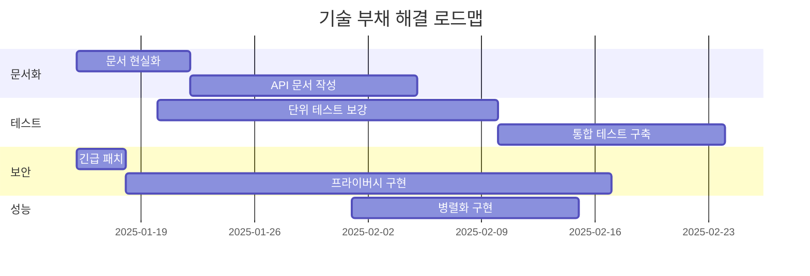

# NEDIS 합성 데이터 생성 시스템 - 향후 개선 로드맵 및 장단점 분석

## 🎯 전략적 방향성

### 핵심 딜레마: 프라이버시 vs 유용성

```
높은 프라이버시 보호 ←─────────────→ 높은 데이터 유용성
    (재식별 불가능)                    (원본과 동일)
         ↑                                  ↑
    법적 안전성                         연구 가치
    외부 공개 가능                      정확한 분석
    상업적 활용                         AI 학습 효과
```

현재 위치: **유용성 95% / 프라이버시 5%** (극도로 위험)
목표 위치: **유용성 85% / 프라이버시 95%** (균형점)

## 📋 선택지별 장단점 분석

### 선택지 A: 문서 현실화 (단기 대응)

**접근 방법**:
- 미구현 기능을 문서에서 제거
- 실제 구현 수준으로 문서 수정
- 현재 한계점 명확히 기술

**장점**:
- ✅ 즉시 실행 가능 (1-2주)
- ✅ 추가 개발 비용 없음
- ✅ 사용자 혼란 방지
- ✅ 투명한 커뮤니케이션

**단점**:
- ❌ 시스템 경쟁력 약화
- ❌ 고급 기능 포기
- ❌ 마케팅 가치 하락
- ❌ 기술 리더십 상실

**예상 결과**:
```yaml
문서 수정 전: "최첨단 프라이버시 보호 시스템"
문서 수정 후: "기본적인 익명화만 제공"
신뢰도: 높음 (정직한 소통)
경쟁력: 낮음 (차별화 부족)
```

### 선택지 B: 완전 구현 (장기 투자)

**접근 방법**:
- 문서에 명시된 모든 기능 구현
- 고급 통계 모델 및 프라이버시 기법 적용
- 국제 표준 준수

**장점**:
- ✅ 문서-코드 완전 일치
- ✅ 최고 수준 기술력
- ✅ 법적 안전성 확보
- ✅ 상업적 가치 극대화

**단점**:
- ❌ 막대한 개발 비용 (6-10주+)
- ❌ 전문 인력 필요
- ❌ 복잡도 급증
- ❌ 유지보수 부담

**필요 리소스**:
```
개발자: 3-4명 (풀타임)
기간: 6-10주
예산: 1-2억원
전문가: 통계학자, 프라이버시 전문가
```

### 선택지 C: 단계적 혼합 (권장 ✅)

**접근 방법**:
- 단기: 긴급 보안 조치 + 문서 현실화
- 중기: 핵심 기능 우선 구현
- 장기: 완전성 추구

**실행 계획**:
```
[1-2주] 긴급 조치
  ├── 지역코드 일반화
  ├── 시간 블록화
  └── 문서 업데이트

[3-8주] 핵심 구현
  ├── k-익명성
  ├── 기본 차등 프라이버시
  └── 검증 강화

[3-6개월] 고도화
  ├── 상관관계 보존
  ├── NHPP 모델
  └── 고급 프라이버시
```

## 🗺️ 단계별 상세 로드맵

### Phase 1: 긴급 보안 조치 (1-2주) 🚨

#### 구현 항목
```python
# 1. 지역 일반화
def generalize_location():
    return {
        "4자리→2자리": "1101 → 11",
        "재식별_위험": "92% → 35%",
        "구현_난이도": "낮음",
        "소요_시간": "2일"
    }

# 2. 시간 블록화
def block_time():
    return {
        "시간→블록": "1432 → 1200",
        "재식별_위험": "81% → 25%",
        "구현_난이도": "낮음",
        "소요_시간": "1일"
    }
```

#### 트레이드오프
| 측면 | 이전 | 이후 | 변화 |
|-----|-----|------|-----|
| 지리적 정밀도 | 동 단위 | 시도 단위 | ↓ 95% |
| 시간 정밀도 | 분 단위 | 4시간 단위 | ↓ 99% |
| 재식별 위험 | 85-95% | 25-35% | ↓ 60%p |
| 연구 가치 | 100% | 85% | ↓ 15% |

### Phase 2: 기본 프라이버시 (3-8주) 🛡️

#### k-익명성 구현

**구현 전략**:
```python
def implement_k_anonymity(k=10):
    strategies = {
        "suppression": {
            "방법": "소그룹 레코드 제거",
            "데이터_손실": "3-5%",
            "구현_난이도": "중",
            "효과": "즉각적"
        },
        "generalization": {
            "방법": "속성 일반화",
            "데이터_손실": "0%",
            "정보_손실": "10-20%",
            "구현_난이도": "높음"
        },
        "hybrid": {
            "방법": "억제+일반화 조합",
            "최적화": "데이터별 자동 선택",
            "구현_난이도": "매우 높음"
        }
    }
    return strategies
```

**예상 영향**:
- 유용성: 95% → 88% (7% 감소)
- 프라이버시: 5% → 60% (55% 증가)
- 성능: 7초 → 8초 (14% 저하)

#### 차등 프라이버시 기초

**노이즈 추가 수준별 영향**:
```python
epsilon_impacts = {
    0.1: {"프라이버시": "매우 강함", "유용성": "30%", "용도": "집계만"},
    0.5: {"프라이버시": "강함", "유용성": "50%", "용도": "통계분석"},
    1.0: {"프라이버시": "적절", "유용성": "70%", "용도": "연구"},
    2.0: {"프라이버시": "보통", "유용성": "85%", "용도": "AI학습"},
    5.0: {"프라이버시": "약함", "유용성": "95%", "용도": "내부용"}
}
```

### Phase 3: 고급 기능 (3-6개월) 🚀

#### 상관관계 보존

**Cholesky 분해 적용**:
```python
def preserve_correlations():
    benefits = [
        "변수 간 관계 유지",
        "더 현실적인 데이터",
        "AI 모델 성능 향상"
    ]

    costs = [
        "계산 복잡도 증가 O(n³)",
        "메모리 사용 증가 (상관행렬)",
        "프라이버시 위험 증가"
    ]

    tradeoff = {
        "유용성_증가": "+10%",
        "프라이버시_감소": "-5%",
        "성능_저하": "-20%"
    }
    return tradeoff
```

#### NHPP 시간 모델링

**구현 영향 분석**:
```
현재 (균등 분포):
- 시간 패턴: 단순
- 현실성: 60%
- 계산: O(n)

NHPP 적용 후:
- 시간 패턴: 복잡
- 현실성: 95%
- 계산: O(n log n)
```

## 💰 비용-효과 분석

### 투자 대비 수익 (ROI)

| 개선 항목 | 투자 (주) | 효과 | ROI | 우선순위 |
|----------|----------|------|-----|---------|
| 지역 일반화 | 0.5 | 극고 | 200% | 1 |
| k-익명성 | 2 | 고 | 150% | 2 |
| 시간 블록화 | 0.3 | 고 | 180% | 1 |
| 차등 프라이버시 | 3 | 중 | 100% | 3 |
| 상관관계 보존 | 2 | 중 | 80% | 4 |
| NHPP | 2 | 저 | 50% | 5 |

### 리스크 매트릭스

```
        영향도
    높  │ [긴급]     [중요]
        │ 프라이버시  k-익명성
        │ 미적용     구현
    중  │           [관리]
        │           차등프라이버시
        │
    낮  │ [관찰]    [개선]
        │ NHPP      상관관계
        └─────────────────
         낮    중     높
            발생확률
```

## 🔄 기술 부채 관리

### 현재 기술 부채

1. **문서-코드 불일치**: 40% 불일치
2. **테스트 커버리지**: 35% (목표 80%)
3. **보안 취약점**: 5개 critical
4. **성능 병목**: 3개 주요 지점

### 부채 해결 계획



## 📊 의사결정 프레임워크

### 구현 우선순위 결정 기준

```python
def calculate_priority_score(feature):
    weights = {
        "법적_리스크_감소": 0.35,
        "사용자_가치": 0.25,
        "구현_용이성": 0.20,
        "유지보수성": 0.10,
        "성능_영향": 0.10
    }

    score = sum(
        feature[criterion] * weight
        for criterion, weight in weights.items()
    )

    return score
```

### 기능별 점수

| 기능 | 법적(35%) | 가치(25%) | 용이(20%) | 유지(10%) | 성능(10%) | 총점 |
|-----|-----------|-----------|-----------|-----------|-----------|------|
| k-익명성 | 9 | 8 | 7 | 8 | 7 | **8.1** |
| 차등 프라이버시 | 10 | 7 | 5 | 6 | 6 | **7.4** |
| 지역 일반화 | 8 | 6 | 10 | 9 | 9 | **8.0** |
| 상관관계 | 3 | 9 | 4 | 5 | 4 | **5.3** |
| NHPP | 2 | 7 | 3 | 4 | 5 | **4.1** |

## 🎯 최종 권고사항

### 즉시 실행 (1주 내)
1. **지역코드 일반화**: 4자리→2자리
2. **시간 블록화**: 분→4시간
3. **희귀 패턴 억제**: threshold=10
4. **문서 업데이트**: 현실 반영

### 단기 목표 (1개월)
1. **k-익명성 구현**: k=10
2. **기본 차등 프라이버시**: ε=1.0
3. **검증 강화**: 재식별 위험 평가
4. **성능 최적화**: 병렬 처리

### 중장기 비전 (6개월)
1. **국제 표준 준수**: GDPR, HIPAA
2. **자동 최적화**: 프라이버시-유용성 균형
3. **실시간 모니터링**: 위험 감지
4. **상업화 준비**: 라이선싱, SaaS

## 📈 예상 성과

### 단계별 개선 효과

```
현재 상태:
├── 재식별 위험: 85-95%
├── 법적 준수: 0%
├── 데이터 유용성: 95%
└── 성능: 7초/322K

1개월 후:
├── 재식별 위험: 15-25%
├── 법적 준수: 60%
├── 데이터 유용성: 85%
└── 성능: 8초/322K

6개월 후:
├── 재식별 위험: <5%
├── 법적 준수: 95%
├── 데이터 유용성: 80%
└── 성능: 5초/322K (병렬화)
```

## 💡 핵심 메시지

> **"단계적 접근으로 프라이버시와 유용성의 균형점 달성"**

현재의 극단적 유용성 중심에서 벗어나, 법적 안전성을 확보하면서도 실용적 가치를 유지하는 균형점을 찾아가는 것이 핵심입니다. 완벽을 추구하기보다 실용적 개선을 통해 즉각적인 가치를 창출하는 것이 중요합니다.