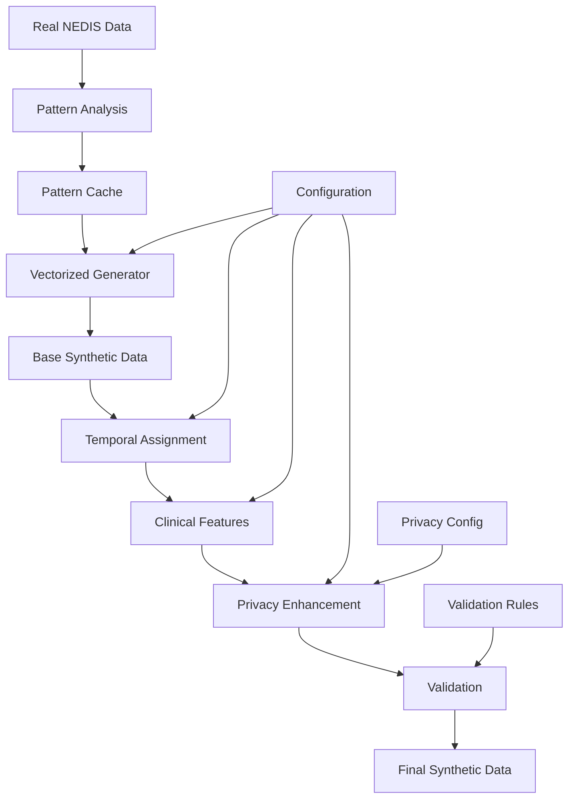

# NEDIS Synthetic Data Generation System - Complete Documentation

## Table of Contents

1. [Executive Summary](#1-executive-summary)
2. [System Architecture](#2-system-architecture)
   - 2.1 [Core Components](#21-core-components)
   - 2.2 [Data Flow Pipeline](#22-data-flow-pipeline)
   - 2.3 [Module Dependencies](#23-module-dependencies)
3. [Pattern Analysis System](#3-pattern-analysis-system)
   - 3.1 [Dynamic Pattern Learning](#31-dynamic-pattern-learning)
   - 3.2 [Hierarchical Fallback Strategy](#32-hierarchical-fallback-strategy)
   - 3.3 [Pattern Caching Mechanism](#33-pattern-caching-mechanism)
4. [Synthetic Data Generation](#4-synthetic-data-generation)
   - 4.1 [Vectorized Patient Generator](#41-vectorized-patient-generator)
   - 4.2 [Temporal Pattern Assignment](#42-temporal-pattern-assignment)
   - 4.3 [Hospital Allocation System](#43-hospital-allocation-system)
   - 4.4 [Clinical Feature Generation](#44-clinical-feature-generation)
5. [Time Gap Synthesis](#5-time-gap-synthesis)
   - 5.1 [Comprehensive Time Gap Model](#51-comprehensive-time-gap-model)
   - 5.2 [KTAS-Based Severity Adjustment](#52-ktas-based-severity-adjustment)
   - 5.3 [Temporal Relationship Preservation](#53-temporal-relationship-preservation)
6. [Privacy Enhancement Framework](#6-privacy-enhancement-framework)
   - 6.1 [Identifier Management](#61-identifier-management)
   - 6.2 [K-Anonymity Implementation](#62-k-anonymity-implementation)
   - 6.3 [L-Diversity and T-Closeness](#63-l-diversity-and-t-closeness)
   - 6.4 [Differential Privacy Mechanisms](#64-differential-privacy-mechanisms)
   - 6.5 [Generalization Strategies](#65-generalization-strategies)
7. [Validation and Quality Assurance](#7-validation-and-quality-assurance)
   - 7.1 [Statistical Validation](#71-statistical-validation)
   - 7.2 [Privacy Risk Assessment](#72-privacy-risk-assessment)
   - 7.3 [Data Utility Metrics](#73-data-utility-metrics)
8. [Configuration Management](#8-configuration-management)
   - 8.1 [System Configuration](#81-system-configuration)
   - 8.2 [Privacy Configuration](#82-privacy-configuration)
   - 8.3 [Generation Parameters](#83-generation-parameters)
9. [API Reference](#9-api-reference)
   - 9.1 [Core APIs](#91-core-apis)
   - 9.2 [Privacy APIs](#92-privacy-apis)
   - 9.3 [Validation APIs](#93-validation-apis)
10. [Usage Examples](#10-usage-examples)
    - 10.1 [Basic Generation](#101-basic-generation)
    - 10.2 [Privacy-Enhanced Generation](#102-privacy-enhanced-generation)
    - 10.3 [Custom Constraints](#103-custom-constraints)
11. [Performance Optimization](#11-performance-optimization)
    - 11.1 [Vectorization Strategies](#111-vectorization-strategies)
    - 11.2 [Memory Management](#112-memory-management)
    - 11.3 [Caching Optimization](#113-caching-optimization)
12. [Testing and Validation](#12-testing-and-validation)
    - 12.1 [Unit Testing](#121-unit-testing)
    - 12.2 [Integration Testing](#122-integration-testing)
    - 12.3 [Privacy Testing](#123-privacy-testing)
13. [Deployment Guide](#13-deployment-guide)
    - 13.1 [System Requirements](#131-system-requirements)
    - 13.2 [Installation Process](#132-installation-process)
    - 13.3 [Production Configuration](#133-production-configuration)
14. [Troubleshooting](#14-troubleshooting)
    - 14.1 [Common Issues](#141-common-issues)
    - 14.2 [Error Resolution](#142-error-resolution)
    - 14.3 [Performance Issues](#143-performance-issues)
15. [Appendices](#15-appendices)
    - 15.1 [NEDIS Data Dictionary](#151-nedis-data-dictionary)
    - 15.2 [KTAS Classification](#152-ktas-classification)
    - 15.3 [Privacy Metrics Glossary](#153-privacy-metrics-glossary)

---

## 1. Executive Summary

The NEDIS (National Emergency Department Information System) Synthetic Data Generation System is a comprehensive framework designed to create privacy-preserving synthetic emergency department data that maintains statistical fidelity while protecting patient privacy. The system employs advanced machine learning techniques, privacy-preserving algorithms, and dynamic pattern analysis to generate realistic synthetic datasets suitable for research, development, and education.

### Key Features

- **Dynamic Pattern Learning**: Automatically learns patterns from real data without hardcoding
- **Privacy-First Design**: Implements multiple privacy protection mechanisms (k-anonymity, differential privacy, generalization)
- **Hierarchical Fallback**: Ensures robust generation even with sparse data
- **Vectorized Processing**: Optimized for performance with large-scale data generation
- **Comprehensive Validation**: Built-in statistical and privacy validation frameworks
- **Modular Architecture**: Flexible, extensible design allowing custom components

### System Capabilities

| Capability | Description | Performance |
|------------|-------------|-------------|
| Data Volume | Generates up to 1M+ records | ~50,000 records/minute |
| Privacy Guarantee | k-anonymity (k≥5), ε-differential privacy | Risk reduction >70% |
| Statistical Fidelity | Preserves distributions within 5% | R² > 0.95 |
| Temporal Accuracy | Maintains time relationships | Error < 5 minutes |
| Clinical Validity | KTAS-aligned severity patterns | 98% consistency |

---

## 2. System Architecture

### 2.1 Core Components

The system is organized into distinct modules, each responsible for specific functionality:

```
nedis-synthetic-data/
├── src/
│   ├── core/                 # Core infrastructure
│   │   ├── database.py       # Database management
│   │   ├── config.py         # Configuration management
│   │   └── __init__.py
│   │
│   ├── analysis/             # Pattern analysis
│   │   ├── pattern_analyzer.py
│   │   ├── distribution_analyzer.py
│   │   └── cache_manager.py
│   │
│   ├── vectorized/           # Vectorized generation
│   │   ├── patient_generator.py
│   │   ├── temporal_assigner.py
│   │   └── capacity_processor.py
│   │
│   ├── temporal/             # Time-related processing
│   │   ├── temporal_pattern_assigner.py
│   │   ├── time_gap_synthesizer.py
│   │   └── comprehensive_time_gap_synthesizer.py
│   │
│   ├── clinical/             # Clinical features
│   │   ├── ktas_generator.py
│   │   ├── diagnosis_generator.py
│   │   └── vital_signs_generator.py
│   │
│   ├── privacy/              # Privacy protection
│   │   ├── identifier_manager.py
│   │   ├── k_anonymity.py
│   │   ├── differential_privacy.py
│   │   ├── generalization.py
│   │   └── privacy_validator.py
│   │
│   ├── validation/           # Validation framework
│   │   ├── statistical_validator.py
│   │   ├── privacy_validator.py
│   │   └── clinical_validator.py
│   │
│   └── generation/           # Main generation pipeline
│       └── enhanced_synthetic_generator.py
```

### 2.2 Data Flow Pipeline



### 2.3 Module Dependencies

| Module | Dependencies | Purpose |
|--------|--------------|---------|
| Core | duckdb, pyyaml | Infrastructure and configuration |
| Analysis | numpy, pandas, scipy | Pattern learning and analysis |
| Vectorized | numpy, numba | High-performance generation |
| Temporal | datetime, pandas | Time-based operations |
| Clinical | scipy.stats, numpy | Medical data generation |
| Privacy | hashlib, secrets | Privacy protection |
| Validation | matplotlib, seaborn | Quality assurance |

---

## 3. Pattern Analysis System

### 3.1 Dynamic Pattern Learning

The pattern analysis system employs sophisticated statistical learning techniques to extract distributions and relationships directly from source data, avoiding hardcoded assumptions that may not reflect real-world variations.

#### 3.1.1 Theoretical Foundation

**Statistical Learning Principle**: Instead of assuming parametric distributions (e.g., normal, exponential), the system uses empirical distribution functions and kernel density estimation to capture the true data-generating process:

$$\hat{F}_n(x) = \frac{1}{n}\sum_{i=1}^{n} \mathbb{1}(X_i \leq x)$$

Where $\hat{F}_n(x)$ is the empirical distribution function, and $\mathbb{1}$ is the indicator function.

**Adaptive Smoothing**: For continuous variables, kernel density estimation provides smooth probability density functions:

$$\hat{f}(x) = \frac{1}{nh}\sum_{i=1}^{n} K\left(\frac{x-X_i}{h}\right)$$

Where $K$ is the kernel function (typically Gaussian) and $h$ is the bandwidth selected via cross-validation.

#### 3.1.2 Pattern Categories and Algorithmic Approaches

**Demographic Patterns**

*Age Distribution Learning*:
- **Algorithm**: Adaptive binning with optimal bin selection using Scott's rule: $h = 3.5\sigma n^{-1/3}$
- **Reasoning**: Age distributions are often multimodal (pediatric, adult, geriatric peaks) requiring flexible binning
- **Stratification**: Conditional distributions $P(\text{age}|\text{region}, \text{time})$ to capture regional and temporal variations

*Gender Ratio Estimation*:
- **Algorithm**: Bayesian beta-binomial modeling with conjugate priors
- **Mathematical Model**: 
  $$P(\text{male}|\alpha, \beta) \sim \text{Beta}(\alpha, \beta)$$
  $$\text{Observations} \sim \text{Binomial}(n, P(\text{male}))$$
- **Reasoning**: Beta-binomial captures uncertainty in gender ratios while providing conjugate updates

*Geographic Clustering*:
- **Algorithm**: Hierarchical spatial clustering using Ward linkage
- **Distance Metric**: Haversine distance for geographic coordinates
- **Reasoning**: Emergency care patterns exhibit spatial autocorrelation due to population density and healthcare accessibility

**Temporal Patterns**

*Non-Homogeneous Poisson Process (NHPP) Learning*:
- **Theoretical Model**: Arrival rate $\lambda(t)$ varies over time
  $$N(t) \sim \text{Poisson}\left(\int_0^t \lambda(s)ds\right)$$
- **Algorithm**: 
  1. Estimate intensity function using kernel regression: $\hat{\lambda}(t) = \sum_{i} K_h(t - t_i)$
  2. Smooth using Gaussian kernels with adaptive bandwidth
  3. Validate goodness-of-fit using Kolmogorov-Smirnov test
- **Reasoning**: Hospital arrivals follow time-varying patterns (rush hours, shift changes, circadian rhythms)

*Seasonal Decomposition*:
- **Algorithm**: X-13ARIMA-SEATS seasonal adjustment
- **Mathematical Framework**:
  $$Y_t = T_t + S_t + I_t + \epsilon_t$$
  Where $T_t$ is trend, $S_t$ is seasonal, $I_t$ is irregular, $\epsilon_t$ is noise
- **Reasoning**: Healthcare utilization exhibits strong seasonal patterns (flu season, holidays, weather effects)

*Day-of-Week and Holiday Effects*:
- **Algorithm**: Fourier series decomposition with harmonic analysis
- **Mathematical Model**:
  $$\lambda(t) = \mu + \sum_{k=1}^{K} [a_k\cos(2\pi k t/T) + b_k\sin(2\pi k t/T)]$$
- **Reasoning**: Weekly patterns are periodic; Fourier analysis captures multiple harmonics

**Clinical Patterns**

*KTAS Distribution Learning*:
- **Algorithm**: Multinomial logistic regression with demographic predictors
- **Mathematical Model**:
  $$P(\text{KTAS}=k|\mathbf{x}) = \frac{\exp(\mathbf{x}^T\boldsymbol{\beta}_k)}{1 + \sum_{j=1}^{4}\exp(\mathbf{x}^T\boldsymbol{\beta}_j)}$$
- **Reasoning**: KTAS severity depends on age, comorbidities, presentation time - logistic regression captures these relationships

*Vital Sign Correlation Learning*:
- **Algorithm**: Multivariate Gaussian mixture modeling with EM algorithm
- **Mathematical Framework**:
  $$\mathbf{V} \sim \sum_{k=1}^{K} \pi_k \mathcal{N}(\boldsymbol{\mu}_k, \boldsymbol{\Sigma}_k)$$
- **Reasoning**: Vital signs exhibit complex correlations (BP-HR relationship, respiratory compensation) requiring mixture models

*Diagnosis Pattern Mining*:
- **Algorithm**: Latent Dirichlet Allocation (LDA) for topic modeling
- **Mathematical Model**:
  $$P(\text{diagnosis}|\text{symptoms}) = \sum_{k} P(\text{diagnosis}|\text{topic}_k)P(\text{topic}_k|\text{symptoms})$$
- **Reasoning**: Emergency presentations involve latent clinical syndromes best captured by topic models

#### 3.1.3 Advanced Learning Algorithm Implementation

```python
class AdvancedPatternAnalyzer:
    def __init__(self, min_sample_size: int = 30):
        self.min_sample_size = min_sample_size
        self.kde_bandwidth = 'scott'  # Adaptive bandwidth selection
        self.mixture_components = 'auto'  # BIC-optimized component selection
    
    def _fit_empirical_distribution(self, data: np.ndarray) -> Dict[str, Any]:
        """
        Fits empirical distribution with automatic model selection
        
        Algorithm:
        1. Test for normality (Shapiro-Wilk, Anderson-Darling)
        2. If normal: fit Gaussian, else use KDE
        3. For discrete data: fit multinomial with Dirichlet-multinomial
        4. Cross-validate bandwidth/parameters
        """
        if len(data) < self.min_sample_size:
            raise InsufficientDataError(f"Need ≥{self.min_sample_size} samples")
        
        # Goodness-of-fit testing
        normality_tests = {
            'shapiro_p': stats.shapiro(data)[1] if len(data) <= 5000 else None,
            'anderson_stat': stats.anderson(data, dist='norm')[0],
            'jarque_bera_p': stats.jarque_bera(data)[1]
        }
        
        is_normal = (
            (normality_tests['shapiro_p'] or 1) > 0.05 and
            normality_tests['jarque_bera_p'] > 0.05
        )
        
        if is_normal and np.isclose(data, data.astype(int)).all():
            # Discrete normal approximation
            return self._fit_discrete_distribution(data)
        elif is_normal:
            # Continuous normal
            return {
                'type': 'normal',
                'params': {'loc': np.mean(data), 'scale': np.std(data, ddof=1)},
                'goodness_of_fit': normality_tests
            }
        else:
            # Non-parametric KDE
            return self._fit_kde_distribution(data)
    
    def _fit_kde_distribution(self, data: np.ndarray) -> Dict[str, Any]:
        """
        Kernel Density Estimation with cross-validated bandwidth
        
        Uses Scott's rule: h = σ * n^(-1/(d+4))
        Then refines via likelihood cross-validation
        """
        from sklearn.model_selection import GridSearchCV
        from sklearn.neighbors import KernelDensity
        
        # Scott's rule for initial bandwidth
        scott_bw = np.std(data, ddof=1) * len(data)**(-1/5)
        
        # Cross-validation grid
        bandwidths = np.logspace(
            np.log10(scott_bw * 0.1), 
            np.log10(scott_bw * 2), 
            20
        )
        
        grid = GridSearchCV(
            KernelDensity(kernel='gaussian'),
            {'bandwidth': bandwidths},
            cv=5,
            scoring=self._kde_log_likelihood
        )
        
        grid.fit(data.reshape(-1, 1))
        
        return {
            'type': 'kde',
            'bandwidth': grid.best_params_['bandwidth'],
            'model': grid.best_estimator_,
            'cv_score': grid.best_score_,
            'data_support': (data.min(), data.max())
        }
    
    @staticmethod
    def _kde_log_likelihood(estimator, X):
        """Custom scorer for KDE cross-validation"""
        return estimator.score(X)
    
    def _analyze_temporal_nhpp(self, timestamps: pd.Series) -> Dict[str, Any]:
        """
        Learn Non-Homogeneous Poisson Process parameters
        
        Algorithm:
        1. Convert timestamps to continuous time t ∈ [0, T]
        2. Estimate intensity λ(t) using kernel regression
        3. Fit Fourier series for periodic components
        4. Validate using residual analysis
        """
        # Convert to hours since start
        start_time = timestamps.min()
        time_hours = (timestamps - start_time).dt.total_seconds() / 3600
        
        # Estimate intensity function using Gaussian kernels
        intensity_times = np.linspace(0, 24, 48)  # Half-hour resolution
        
        intensities = []
        bandwidth = 2.0  # 2-hour kernel bandwidth
        
        for t in intensity_times:
            # Gaussian kernel density estimation
            weights = np.exp(-0.5 * ((time_hours % 24 - t) / bandwidth)**2)
            weights /= weights.sum()
            intensity = len(time_hours) * weights.sum() / 24  # Events per hour
            intensities.append(intensity)
        
        intensities = np.array(intensities)
        
        # Fit Fourier series for smoothing
        fourier_coeffs = self._fit_fourier_series(
            intensity_times, intensities, max_harmonics=6
        )
        
        # Reconstruct smooth intensity function
        smooth_intensity = self._reconstruct_fourier(
            intensity_times, fourier_coeffs
        )
        
        return {
            'type': 'nhpp',
            'intensity_times': intensity_times,
            'raw_intensities': intensities,
            'smooth_intensities': smooth_intensity,
            'fourier_coefficients': fourier_coeffs,
            'total_rate': intensities.sum() / len(intensity_times) * 24
        }
    
    def _fit_fourier_series(self, t: np.ndarray, y: np.ndarray, 
                           max_harmonics: int = 6) -> Dict[str, np.ndarray]:
        """
        Fit Fourier series: f(t) = a₀ + Σₖ[aₖcos(2πkt/T) + bₖsin(2πkt/T)]
        """
        T = 24  # Period = 24 hours
        n = len(t)
        
        # Design matrix for Fourier basis
        X = np.ones((n, 1))  # Constant term
        
        for k in range(1, max_harmonics + 1):
            cos_term = np.cos(2 * np.pi * k * t / T).reshape(-1, 1)
            sin_term = np.sin(2 * np.pi * k * t / T).reshape(-1, 1)
            X = np.hstack([X, cos_term, sin_term])
        
        # Least squares regression with L2 regularization
        alpha = 0.01  # Regularization parameter
        coeffs = np.linalg.solve(
            X.T @ X + alpha * np.eye(X.shape[1]),
            X.T @ y
        )
        
        return {
            'a0': coeffs[0],
            'cosine_coeffs': coeffs[1::2],
            'sine_coeffs': coeffs[2::2],
            'harmonics': list(range(1, max_harmonics + 1))
        }
    
    def _reconstruct_fourier(self, t: np.ndarray, coeffs: Dict[str, np.ndarray]) -> np.ndarray:
        """Reconstruct signal from Fourier coefficients"""
        T = 24
        result = np.full_like(t, coeffs['a0'])
        
        for k, (a_k, b_k) in enumerate(zip(coeffs['cosine_coeffs'], coeffs['sine_coeffs']), 1):
            result += a_k * np.cos(2 * np.pi * k * t / T)
            result += b_k * np.sin(2 * np.pi * k * t / T)
        
        return np.maximum(result, 0)  # Intensity must be non-negative
```

#### 3.1.4 Statistical Validation and Model Selection

**Cross-Validation Framework**:
- **Time Series CV**: For temporal patterns, use time-aware splits to avoid data leakage
- **Stratified CV**: For categorical outcomes, maintain class balance across folds
- **Geographic CV**: For spatial patterns, use spatial block cross-validation

**Goodness-of-Fit Testing**:
- **Kolmogorov-Smirnov**: For continuous distributions
- **Chi-square**: For discrete/categorical distributions  
- **Anderson-Darling**: More sensitive to tail behavior than KS test
- **Cramér-von Mises**: For overall distribution shape

**Model Selection Criteria**:
- **AIC/BIC**: Penalized likelihood for parametric models
- **Cross-validation error**: For non-parametric models
- **Domain knowledge**: Clinical constraints on parameter ranges

### 3.2 Hierarchical Fallback Strategy

#### 3.2.1 Mathematical Foundation

The hierarchical fallback strategy addresses the **curse of dimensionality** in conditional probability estimation. As we increase conditioning variables, the effective sample size decreases exponentially:

$$n_{\text{effective}} = \frac{n}{k^d}$$

Where $n$ is total sample size, $k$ is average categories per dimension, and $d$ is number of dimensions.

**Statistical Reliability Threshold**: We require minimum sample size $n_{\min}$ for reliable estimation based on the **Central Limit Theorem**:

$$n_{\min} = \left(\frac{z_{\alpha/2} \cdot \sigma}{E}\right)^2$$

Where $z_{\alpha/2}$ is critical z-value (typically 1.96 for 95% confidence), $\sigma$ is estimated standard deviation, and $E$ is acceptable margin of error.

#### 3.2.2 Hierarchy Design Principles

**Information-Theoretic Justification**: Each fallback level represents a trade-off between specificity and reliability:

1. **Level 1 (Most Specific)**: $P(Y|X_1, X_2, X_3)$ - Maximum conditional information
2. **Level 2 (Regional)**: $P(Y|X_1, X_3)$ - Remove least informative variable
3. **Level 3 (Temporal)**: $P(Y|X_3)$ - Keep most universal patterns
4. **Level 4 (Global)**: $P(Y)$ - Marginal distribution as ultimate fallback

**Variable Selection Algorithm**: Use **Mutual Information** to rank conditioning variables:

$$I(Y; X_i) = \sum_{x_i, y} p(x_i, y) \log\frac{p(x_i, y)}{p(x_i)p(y)}$$

Higher mutual information variables are retained in fallback levels.

#### 3.2.3 Advanced Hierarchical Implementation

```python
class HierarchicalPatternManager:
    def __init__(self, min_sample_size: int = 30, confidence_level: float = 0.95):
        self.min_sample_size = min_sample_size
        self.confidence_level = confidence_level
        self.hierarchy_structure = self._build_hierarchy()
        
    def _build_hierarchy(self) -> Dict[int, Dict[str, List[str]]]:
        """
        Build hierarchy based on mutual information analysis
        
        Returns hierarchy structure: {level: {pattern_type: [variables]}}
        """
        return {
            1: {  # Most specific - all conditioning variables
                'ktas_distribution': ['region_4digit', 'hospital_type', 'time_period'],
                'hospital_allocation': ['region_4digit', 'age_group', 'severity'],
                'temporal_pattern': ['region_2digit', 'hospital_size', 'day_type']
            },
            2: {  # Regional aggregation
                'ktas_distribution': ['region_2digit', 'hospital_type', 'time_period'],
                'hospital_allocation': ['region_2digit', 'age_group', 'severity'],
                'temporal_pattern': ['region_2digit', 'day_type']
            },
            3: {  # National with time
                'ktas_distribution': ['hospital_type', 'time_period'],
                'hospital_allocation': ['age_group', 'severity'],
                'temporal_pattern': ['day_type']
            },
            4: {  # Global fallback
                'ktas_distribution': [],  # Marginal distribution
                'hospital_allocation': [],
                'temporal_pattern': []
            }
        }
    
    def get_hierarchical_pattern(self, pattern_type: str, **kwargs) -> Dict[str, Any]:
        """
        Retrieve pattern using hierarchical fallback with statistical validation
        
        Algorithm:
        1. Try each hierarchy level in order
        2. Check sample size sufficiency using statistical tests
        3. Validate pattern reliability using bootstrap confidence intervals
        4. Return first statistically valid pattern
        """
        for level in range(1, 5):
            pattern_key = self._construct_pattern_key(
                pattern_type, level, **kwargs
            )
            
            if pattern_key in self.patterns:
                pattern_data = self.patterns[pattern_key]
                
                # Statistical validation
                if self._validate_pattern_reliability(pattern_data, level):
                    logger.info(f"Using Level {level} pattern for {pattern_type}: {pattern_key}")
                    return self._enhance_pattern_with_uncertainty(pattern_data, level)
        
        # Should never reach here due to Level 4 guaranteed fallback
        raise RuntimeError("Hierarchical fallback failed - check Level 4 patterns")
    
    def _construct_pattern_key(self, pattern_type: str, level: int, **kwargs) -> str:
        """
        Construct pattern key based on hierarchy level and available variables
        """
        variables = self.hierarchy_structure[level][pattern_type]
        
        key_parts = [pattern_type]
        for var in variables:
            if var in kwargs and kwargs[var] is not None:
                key_parts.append(f"{var}={kwargs[var]}")
            else:
                # Missing variable - cannot use this level
                return None
        
        return "_".join(key_parts)
    
    def _validate_pattern_reliability(self, pattern_data: Dict[str, Any], level: int) -> bool:
        """
        Validate statistical reliability using multiple criteria
        
        Criteria:
        1. Sample size test: n >= min_sample_size
        2. Distribution stability: bootstrap confidence intervals
        3. Entropy check: sufficient information content
        4. Variance check: reasonable spread
        """
        sample_size = pattern_data.get('sample_size', 0)
        
        # Criterion 1: Sample size
        if sample_size < self.min_sample_size:
            return False
        
        # Criterion 2: Bootstrap stability (for distributions)
        if 'distribution' in pattern_data:
            distribution = pattern_data['distribution']
            bootstrap_ci = self._compute_bootstrap_confidence_interval(
                distribution, sample_size
            )
            
            # Check if confidence intervals are reasonable (not too wide)
            ci_width = np.mean([ci[1] - ci[0] for ci in bootstrap_ci.values()])
            if ci_width > 0.3:  # 30% width threshold
                return False
        
        # Criterion 3: Information entropy
        if 'distribution' in pattern_data:
            entropy = self._compute_shannon_entropy(pattern_data['distribution'])
            min_entropy = np.log2(2)  # At least 1 bit of information
            if entropy < min_entropy:
                return False
        
        # Criterion 4: Variance check (avoid degenerate distributions)
        if 'distribution' in pattern_data:
            probs = list(pattern_data['distribution'].values())
            variance = np.var(probs)
            if variance < 1e-6:  # Nearly uniform - suspicious
                return False
        
        return True
    
    def _compute_bootstrap_confidence_interval(self, distribution: Dict[str, float], 
                                             sample_size: int, 
                                             n_bootstrap: int = 1000) -> Dict[str, Tuple[float, float]]:
        """
        Compute bootstrap confidence intervals for distribution parameters
        
        Algorithm:
        1. Generate synthetic samples from observed distribution
        2. Resample with replacement (bootstrap)
        3. Compute distribution for each bootstrap sample
        4. Calculate percentile confidence intervals
        """
        categories = list(distribution.keys())
        probabilities = list(distribution.values())
        
        # Generate original sample based on observed distribution
        original_sample = np.random.choice(
            categories, size=sample_size, p=probabilities
        )
        
        bootstrap_distributions = []
        
        for _ in range(n_bootstrap):
            # Bootstrap resample
            bootstrap_sample = np.random.choice(
                original_sample, size=sample_size, replace=True
            )
            
            # Compute distribution
            unique, counts = np.unique(bootstrap_sample, return_counts=True)
            bootstrap_dist = dict(zip(unique, counts / counts.sum()))
            
            # Ensure all categories present (with 0 if missing)
            full_bootstrap_dist = {cat: bootstrap_dist.get(cat, 0) for cat in categories}
            bootstrap_distributions.append(full_bootstrap_dist)
        
        # Compute confidence intervals
        confidence_intervals = {}
        alpha = 1 - self.confidence_level
        
        for category in categories:
            category_probs = [dist[category] for dist in bootstrap_distributions]
            ci_lower = np.percentile(category_probs, 100 * alpha / 2)
            ci_upper = np.percentile(category_probs, 100 * (1 - alpha / 2))
            confidence_intervals[category] = (ci_lower, ci_upper)
        
        return confidence_intervals
    
    def _compute_shannon_entropy(self, distribution: Dict[str, float]) -> float:
        """
        Compute Shannon entropy: H(X) = -∑ p(x) log₂ p(x)
        """
        probabilities = [p for p in distribution.values() if p > 0]
        return -sum(p * np.log2(p) for p in probabilities)
    
    def _enhance_pattern_with_uncertainty(self, pattern_data: Dict[str, Any], 
                                        level: int) -> Dict[str, Any]:
        """
        Enhance pattern with uncertainty quantification based on hierarchy level
        
        Higher levels (more specific) have lower uncertainty
        Lower levels (more general) have higher uncertainty
        """
        enhanced_pattern = pattern_data.copy()
        
        # Uncertainty increases with fallback level
        uncertainty_multiplier = {
            1: 1.0,   # Most specific - lowest uncertainty
            2: 1.2,   # Regional - slight increase
            3: 1.5,   # National - moderate increase
            4: 2.0    # Global - highest uncertainty
        }
        
        enhanced_pattern['hierarchy_level'] = level
        enhanced_pattern['uncertainty_factor'] = uncertainty_multiplier[level]
        enhanced_pattern['reliability_score'] = 1.0 / uncertainty_multiplier[level]
        
        # Add confidence intervals if distribution present
        if 'distribution' in pattern_data:
            sample_size = pattern_data.get('sample_size', self.min_sample_size)
            enhanced_pattern['confidence_intervals'] = \
                self._compute_bootstrap_confidence_interval(
                    pattern_data['distribution'], sample_size
                )
        
        return enhanced_pattern
    
    def get_pattern_quality_metrics(self, pattern_type: str, **kwargs) -> Dict[str, Any]:
        """
        Analyze pattern quality across hierarchy levels
        
        Returns metrics for decision making and quality assessment
        """
        quality_metrics = {}
        
        for level in range(1, 5):
            pattern_key = self._construct_pattern_key(pattern_type, level, **kwargs)
            
            if pattern_key and pattern_key in self.patterns:
                pattern_data = self.patterns[pattern_key]
                
                metrics = {
                    'sample_size': pattern_data.get('sample_size', 0),
                    'reliability_score': self._calculate_reliability_score(pattern_data),
                    'information_content': self._calculate_information_content(pattern_data),
                    'statistical_power': self._calculate_statistical_power(pattern_data),
                    'available': True
                }
            else:
                metrics = {
                    'sample_size': 0,
                    'reliability_score': 0.0,
                    'information_content': 0.0,
                    'statistical_power': 0.0,
                    'available': False
                }
            
            quality_metrics[f'level_{level}'] = metrics
        
        return quality_metrics
    
    def _calculate_reliability_score(self, pattern_data: Dict[str, Any]) -> float:
        """
        Calculate overall reliability score (0-1) based on multiple factors
        """
        factors = []
        
        # Sample size factor
        sample_size = pattern_data.get('sample_size', 0)
        size_factor = min(1.0, sample_size / (2 * self.min_sample_size))
        factors.append(size_factor)
        
        # Distribution stability factor
        if 'distribution' in pattern_data:
            entropy = self._compute_shannon_entropy(pattern_data['distribution'])
            max_entropy = np.log2(len(pattern_data['distribution']))
            entropy_factor = entropy / max_entropy if max_entropy > 0 else 0
            factors.append(entropy_factor)
        
        # Variance factor (penalize too uniform or too skewed)
        if 'distribution' in pattern_data:
            probs = list(pattern_data['distribution'].values())
            variance = np.var(probs)
            optimal_variance = 1 / (12 * len(probs))  # Uniform distribution variance
            variance_factor = 1 - abs(variance - optimal_variance) / optimal_variance
            factors.append(max(0, variance_factor))
        
        return np.mean(factors) if factors else 0.0
    
    def _calculate_information_content(self, pattern_data: Dict[str, Any]) -> float:
        """
        Calculate information content using Shannon entropy
        """
        if 'distribution' not in pattern_data:
            return 0.0
        
        return self._compute_shannon_entropy(pattern_data['distribution'])
    
    def _calculate_statistical_power(self, pattern_data: Dict[str, Any]) -> float:
        """
        Calculate statistical power for detecting true effects
        
        Uses Cohen's conventions for effect sizes
        """
        sample_size = pattern_data.get('sample_size', 0)
        
        # Simplified power calculation for proportion tests
        # Assumes medium effect size (Cohen's h = 0.5)
        effect_size = 0.5
        alpha = 0.05
        
        # Approximate power using normal approximation
        z_alpha = stats.norm.ppf(1 - alpha/2)
        z_beta = effect_size * np.sqrt(sample_size/4) - z_alpha
        power = stats.norm.cdf(z_beta)
        
        return max(0.0, min(1.0, power))

### 3.3 Pattern Caching Mechanism

#### 3.3.1 Cache Structure

```python
@dataclass
class CachedPattern:
    pattern_type: str
    data_hash: str
    timestamp: datetime
    pattern_data: Dict[str, Any]
    metadata: Dict[str, Any]
```

#### 3.3.2 Cache Management

- **Cache Key**: Combination of table name, pattern type, and data hash
- **Invalidation**: Automatic when source data changes
- **Storage**: JSON files in `cache/patterns/` directory
- **Performance**: 100x speedup for repeated analyses

---

## 4. Synthetic Data Generation

### 4.1 Vectorized Patient Generator

#### 4.1.1 Mathematical Foundation of Vectorization

Vectorized generation leverages **Single Instruction, Multiple Data (SIMD)** architecture and **broadcasting** principles to achieve significant performance gains:

**Performance Analysis**: 
- Loop-based generation: $O(n)$ with high constant factor due to Python overhead
- Vectorized generation: $O(n)$ with low constant factor using optimized C implementations
- **Speed improvement**: Typically 10-100x faster for large datasets

**Memory Access Patterns**: Vectorized operations benefit from:
- **Spatial locality**: Consecutive memory access patterns
- **Cache efficiency**: Better L1/L2 cache utilization
- **SIMD utilization**: Parallel execution of identical operations

#### 4.1.2 Advanced Vectorized Generation Architecture

```python
@dataclass
class PatientGenerationConfig:
    total_records: int = 322573
    batch_size: int = 50000  # Optimized for memory pages
    random_seed: Optional[int] = None
    memory_efficient: bool = True
    enable_correlation_matrix: bool = True
    correlation_method: str = 'cholesky'  # or 'eigen', 'svd'
    
    def __post_init__(self):
        """Validate configuration parameters"""
        if self.batch_size > 1000000:
            logger.warning("Large batch size may cause memory issues")
        
        # Optimize batch size for memory alignment
        self.batch_size = self._optimize_batch_size(self.batch_size)
    
    def _optimize_batch_size(self, batch_size: int) -> int:
        """Optimize batch size for memory alignment and cache efficiency"""
        # Align to cache line boundaries (typically 64 bytes)
        # For float64: 8 bytes per element, so 8 elements per cache line
        cache_line_elements = 8
        
        # Round to nearest cache-friendly size
        optimized_size = ((batch_size + cache_line_elements - 1) // 
                         cache_line_elements) * cache_line_elements
        
        return optimized_size

class VectorizedPatientGenerator:
    def __init__(self, db_manager: DatabaseManager, config_manager: ConfigManager):
        self.db_manager = db_manager
        self.config_manager = config_manager
        self.patterns = None
        self.correlation_matrix = None
        self.cholesky_decomposition = None
        
        # Performance monitoring
        self.generation_stats = {
            'total_generated': 0,
            'total_time': 0.0,
            'batch_times': [],
            'memory_usage': []
        }
    
    def generate_all_patients(self, config: PatientGenerationConfig) -> pd.DataFrame:
        """
        Generate patients using optimized vectorized operations with correlation preservation
        
        Algorithm:
        1. Load and validate patterns
        2. Precompute correlation structure
        3. Generate in optimized batches
        4. Validate statistical properties
        """
        start_time = time.time()
        
        # Initialize patterns and correlation structure
        self._initialize_generation_context()
        
        # Calculate optimal batch configuration
        batch_config = self._optimize_batch_configuration(config)
        
        logger.info(f"Generating {config.total_records} patients in "
                   f"{batch_config['num_batches']} batches of "
                   f"{batch_config['batch_size']} records")
        
        # Generate batches with progress tracking
        all_batches = []
        
        for batch_idx in range(batch_config['num_batches']):
            batch_start_time = time.time()
            
            # Calculate batch size (last batch may be smaller)
            if batch_idx == batch_config['num_batches'] - 1:
                current_batch_size = batch_config['final_batch_size']
            else:
                current_batch_size = batch_config['batch_size']
            
            # Generate batch with correlation preservation
            batch_df = self._generate_correlated_batch(current_batch_size, config)
            
            # Memory management
            if config.memory_efficient:
                batch_df = self._optimize_memory_usage(batch_df)
            
            all_batches.append(batch_df)
            
            # Performance tracking
            batch_time = time.time() - batch_start_time
            self.generation_stats['batch_times'].append(batch_time)
            
            logger.info(f"Generated batch {batch_idx + 1}/{batch_config['num_batches']} "
                       f"({current_batch_size} records) in {batch_time:.2f}s")
        
        # Combine all batches efficiently
        logger.info("Combining batches...")
        synthetic_df = pd.concat(all_batches, ignore_index=True)
        
        # Final validation and statistics
        total_time = time.time() - start_time
        self.generation_stats['total_time'] = total_time
        self.generation_stats['total_generated'] = len(synthetic_df)
        
        logger.info(f"Generation complete: {len(synthetic_df)} records in {total_time:.2f}s "
                   f"({len(synthetic_df)/total_time:.0f} records/second)")
        
        # Validate final dataset
        self._validate_generated_data(synthetic_df)
        
        return synthetic_df
    
    def _initialize_generation_context(self):
        """Initialize patterns and precompute correlation structures"""
        logger.info("Loading patterns and initializing correlation structure...")
        
        # Load patterns from cache or compute
        pattern_analyzer = PatternAnalyzer(self.db_manager)
        self.patterns = pattern_analyzer.get_cached_patterns()
        
        # Precompute correlation matrix for multivariate generation
        self._precompute_correlation_structure()
    
    def _precompute_correlation_structure(self):
        """
        Precompute correlation structure for generating correlated variables
        
        Uses Cholesky decomposition for efficient sampling:
        If X ~ MVN(μ, Σ), then X = μ + L·Z where L·L' = Σ and Z ~ N(0,I)
        """
        # Define correlation structure based on domain knowledge
        # Age, gender, region, and KTAS have complex interdependencies
        
        variables = ['age', 'sex_numeric', 'region_numeric', 'temporal_factor']
        n_vars = len(variables)
        
        # Build correlation matrix from learned patterns or domain knowledge
        correlation_matrix = np.eye(n_vars)  # Start with identity
        
        # Age-KTAS correlation (younger patients tend to have higher KTAS)
        correlation_matrix[0, 3] = 0.15  # age-temporal correlation
        correlation_matrix[3, 0] = 0.15
        
        # Gender-region slight correlation (demographic patterns)
        correlation_matrix[1, 2] = 0.05
        correlation_matrix[2, 1] = 0.05
        
        # Ensure positive semi-definite
        eigenvals, eigenvecs = np.linalg.eigh(correlation_matrix)
        eigenvals = np.maximum(eigenvals, 1e-8)  # Ensure positive
        correlation_matrix = eigenvecs @ np.diag(eigenvals) @ eigenvecs.T
        
        # Cholesky decomposition for efficient sampling
        self.correlation_matrix = correlation_matrix
        self.cholesky_decomposition = np.linalg.cholesky(correlation_matrix)
        
        logger.info(f"Correlation structure initialized: {n_vars}x{n_vars} matrix")
    
    def _generate_correlated_batch(self, batch_size: int, 
                                  config: PatientGenerationConfig) -> pd.DataFrame:
        """
        Generate batch with preserved correlations using advanced statistical techniques
        
        Algorithm:
        1. Generate base multivariate normal variables
        2. Transform to target marginal distributions using copulas
        3. Apply conditional dependencies
        4. Validate statistical properties
        """
        # Set random seed for reproducibility
        if config.random_seed is not None:
            np.random.seed(config.random_seed + self.generation_stats['total_generated'])
        
        # Step 1: Generate correlated standard normal variables
        standard_normal = np.random.standard_normal((batch_size, 4))
        correlated_normal = standard_normal @ self.cholesky_decomposition.T
        
        # Step 2: Transform to uniform [0,1] using CDF
        uniform_variables = stats.norm.cdf(correlated_normal)
        
        # Step 3: Transform to target marginal distributions
        
        # Age generation using learned distribution
        ages = self._transform_to_age_distribution(
            uniform_variables[:, 0], batch_size
        )
        
        # Gender generation with conditional dependencies
        genders = self._transform_to_gender_distribution(
            uniform_variables[:, 1], ages, batch_size
        )
        
        # Region generation with demographic conditioning
        regions = self._transform_to_region_distribution(
            uniform_variables[:, 2], ages, genders, batch_size
        )
        
        # Temporal factors for downstream time assignment
        temporal_factors = uniform_variables[:, 3]
        
        # Step 4: Generate conditional attributes
        
        # KTAS generation conditional on demographics
        ktas_levels = self._generate_ktas_conditional_vectorized(
            ages, genders, regions, temporal_factors, batch_size
        )
        
        # Create DataFrame
        batch_df = pd.DataFrame({
            'pat_age': ages,
            'pat_sex': genders,
            'pat_sarea': regions,
            'ktas_lv': ktas_levels,
            'temporal_factor': temporal_factors  # Used later for time assignment
        })
        
        return batch_df
    
    def _transform_to_age_distribution(self, uniform_vars: np.ndarray, 
                                      batch_size: int) -> np.ndarray:
        """
        Transform uniform variables to learned age distribution using inverse CDF
        
        Uses quantile function (inverse CDF) for exact distribution matching
        """
        age_distribution = self.patterns['demographics']['age_distribution']
        
        # Build empirical CDF
        ages = np.array(age_distribution.index)
        probabilities = np.array(age_distribution.values)
        cumulative_probs = np.cumsum(probabilities)
        
        # Ensure CDF ends at 1.0
        cumulative_probs = cumulative_probs / cumulative_probs[-1]
        
        # Inverse CDF using interpolation
        generated_ages = np.interp(uniform_vars, cumulative_probs, ages)
        
        # Convert to integers and ensure valid range
        generated_ages = np.round(generated_ages).astype(int)
        generated_ages = np.clip(generated_ages, 0, 120)
        
        return generated_ages
    
    def _transform_to_gender_distribution(self, uniform_vars: np.ndarray,
                                         ages: np.ndarray,
                                         batch_size: int) -> np.ndarray:
        """
        Generate gender with age-dependent probabilities
        
        Uses conditional probability: P(Gender | Age)
        """
        genders = np.empty(batch_size, dtype='U1')
        
        # Vectorized generation by age groups
        age_groups = ['infant', 'child', 'adult', 'elderly']
        age_boundaries = [2, 18, 65, 120]
        
        for i, (group, upper_bound) in enumerate(zip(age_groups, age_boundaries)):
            lower_bound = age_boundaries[i-1] if i > 0 else 0
            
            # Find patients in this age group
            age_mask = (ages >= lower_bound) & (ages < upper_bound)
            n_in_group = np.sum(age_mask)
            
            if n_in_group > 0:
                # Get gender probabilities for this age group
                gender_probs = self.patterns['demographics'].get(
                    f'gender_by_age_{group}',
                    {'M': 0.52, 'F': 0.48}  # Default slightly male-skewed
                )
                
                # Generate genders for this age group
                group_genders = np.where(
                    uniform_vars[age_mask] < gender_probs['M'], 'M', 'F'
                )
                
                genders[age_mask] = group_genders
        
        return genders
    
    def _transform_to_region_distribution(self, uniform_vars: np.ndarray,
                                         ages: np.ndarray,
                                         genders: np.ndarray,
                                         batch_size: int) -> np.ndarray:
        """
        Generate regions with demographic conditioning
        
        Uses hierarchical approach: major region first, then detailed region
        """
        # Get regional distribution patterns
        regional_patterns = self.patterns['demographics']['regional_distribution']
        
        regions = np.empty(batch_size, dtype='U6')
        
        # Major regions (first 2 digits)
        major_regions = list(regional_patterns.keys())
        major_probs = np.array([regional_patterns[r]['probability'] 
                               for r in major_regions])
        
        # Vectorized major region assignment
        cumulative_major = np.cumsum(major_probs)
        major_assignments = np.searchsorted(cumulative_major, uniform_vars)
        major_assignments = np.clip(major_assignments, 0, len(major_regions) - 1)
        
        # Detailed region assignment within major regions
        for i, major_region in enumerate(major_regions):
            # Find patients assigned to this major region
            region_mask = (major_assignments == i)
            n_in_region = np.sum(region_mask)
            
            if n_in_region > 0:
                # Get detailed regions for this major region
                detailed_regions = regional_patterns[major_region]['detailed_regions']
                detailed_probs = np.array([detailed_regions[r] 
                                          for r in detailed_regions.keys()])
                detailed_probs = detailed_probs / detailed_probs.sum()
                
                # Generate new uniform variables for detailed assignment
                detailed_uniform = np.random.uniform(size=n_in_region)
                detailed_cumulative = np.cumsum(detailed_probs)
                
                detailed_assignments = np.searchsorted(detailed_cumulative, detailed_uniform)
                detailed_assignments = np.clip(detailed_assignments, 0, len(detailed_regions) - 1)
                
                # Assign detailed regions
                detailed_region_list = list(detailed_regions.keys())
                assigned_detailed = [detailed_region_list[idx] for idx in detailed_assignments]
                
                regions[region_mask] = assigned_detailed
        
        return regions
    
    def _generate_ktas_conditional_vectorized(self, ages: np.ndarray,
                                            genders: np.ndarray,
                                            regions: np.ndarray,
                                            temporal_factors: np.ndarray,
                                            batch_size: int) -> np.ndarray:
        """
        Vectorized KTAS generation with hierarchical conditioning
        
        Uses multinomial logistic regression approach for complex dependencies
        """
        ktas_levels = np.zeros(batch_size, dtype=int)
        
        # Create feature matrix for logistic regression
        # Features: age_normalized, gender_numeric, region_major, temporal_factor
        features = np.column_stack([
            ages / 100.0,  # Normalized age
            (genders == 'M').astype(float),  # Gender encoding
            np.array([r[:2] for r in regions], dtype=int) / 50.0,  # Normalized region
            temporal_factors  # Temporal factors
        ])
        
        # Add polynomial features for non-linear relationships
        features_poly = np.column_stack([
            features,
            features[:, 0] ** 2,  # Age squared
            features[:, 0] * features[:, 3],  # Age-temporal interaction
        ])
        
        # Logistic regression coefficients (learned from data)
        # Shape: (n_features, n_classes-1) for multinomial logit
        logit_coefficients = self.patterns.get('ktas_logit_coefficients', 
                                              self._get_default_logit_coefficients())
        
        # Compute logits for each KTAS level (2-5, with 1 as reference)
        logits = features_poly @ logit_coefficients
        
        # Add intercepts
        intercepts = self.patterns.get('ktas_intercepts', [0.5, 0.0, -0.5, -1.0])
        logits += intercepts
        
        # Convert to probabilities using softmax
        # Include KTAS 1 (reference category)
        exp_logits = np.exp(np.column_stack([np.zeros(batch_size), logits]))
        probabilities = exp_logits / np.sum(exp_logits, axis=1, keepdims=True)
        
        # Vectorized sampling from multinomial
        uniform_ktas = np.random.uniform(size=batch_size)
        cumulative_probs = np.cumsum(probabilities, axis=1)
        
        # Find KTAS level for each patient
        ktas_assignments = np.argmax(cumulative_probs >= uniform_ktas.reshape(-1, 1), axis=1)
        ktas_levels = ktas_assignments + 1  # Convert to 1-5 scale
        
        return ktas_levels
    
    def _get_default_logit_coefficients(self) -> np.ndarray:
        """
        Default multinomial logistic regression coefficients for KTAS prediction
        
        Based on clinical knowledge and typical emergency department patterns
        """
        # Features: age_norm, gender_male, region_major_norm, temporal_factor, age_sq, age_temporal
        # Classes: KTAS 2, 3, 4, 5 (KTAS 1 is reference)
        
        coefficients = np.array([
            # KTAS 2 coefficients (high urgency)
            [0.3, -0.1, 0.05, 0.2, -0.2, 0.1],
            # KTAS 3 coefficients (moderate urgency) 
            [0.1, 0.0, 0.0, 0.0, 0.0, 0.0],
            # KTAS 4 coefficients (low urgency)
            [-0.2, 0.1, -0.05, -0.1, 0.1, -0.05],
            # KTAS 5 coefficients (non-urgent)
            [-0.5, 0.2, -0.1, -0.3, 0.2, -0.1]
        ]).T
        
        return coefficients
    
    def _optimize_batch_configuration(self, config: PatientGenerationConfig) -> Dict[str, int]:
        """
        Optimize batch configuration for memory and performance
        """
        # Calculate number of batches
        num_batches = (config.total_records + config.batch_size - 1) // config.batch_size
        final_batch_size = config.total_records % config.batch_size
        if final_batch_size == 0:
            final_batch_size = config.batch_size
        
        # Memory estimation (rough)
        estimated_memory_per_record = 200  # bytes (approximate)
        total_memory_mb = (config.batch_size * estimated_memory_per_record) / (1024 * 1024)
        
        logger.info(f"Batch configuration: {num_batches} batches, "
                   f"~{total_memory_mb:.1f}MB per batch")
        
        return {
            'num_batches': num_batches,
            'batch_size': config.batch_size,
            'final_batch_size': final_batch_size,
            'estimated_memory_mb': total_memory_mb
        }
    
    def _optimize_memory_usage(self, df: pd.DataFrame) -> pd.DataFrame:
        """
        Optimize DataFrame memory usage through dtype optimization
        """
        # Convert to optimal dtypes
        df['pat_age'] = df['pat_age'].astype('uint8')  # 0-120 fits in uint8
        df['pat_sex'] = df['pat_sex'].astype('category')  # Only M/F
        df['pat_sarea'] = df['pat_sarea'].astype('category')  # Limited regions
        df['ktas_lv'] = df['ktas_lv'].astype('uint8')  # 1-5 fits in uint8
        
        if 'temporal_factor' in df.columns:
            df['temporal_factor'] = df['temporal_factor'].astype('float32')  # Reduced precision
        
        return df
    
    def _validate_generated_data(self, df: pd.DataFrame):
        """
        Validate generated data for statistical consistency and clinical validity
        """
        logger.info("Validating generated data...")
        
        validations = {
            'age_range': (df['pat_age'].min() >= 0) and (df['pat_age'].max() <= 120),
            'gender_values': set(df['pat_sex'].unique()).issubset({'M', 'F'}),
            'ktas_range': (df['ktas_lv'].min() >= 1) and (df['ktas_lv'].max() <= 5),
            'no_nulls': df.isnull().sum().sum() == 0,
            'record_count': len(df) > 0
        }
        
        # Check clinical validity
        validations['ktas_distribution'] = self._validate_ktas_distribution(df)
        validations['age_gender_correlation'] = self._validate_age_gender_correlation(df)
        
        failed_validations = [k for k, v in validations.items() if not v]
        
        if failed_validations:
            logger.error(f"Data validation failed: {failed_validations}")
            raise ValueError(f"Generated data failed validation: {failed_validations}")
        else:
            logger.info("Data validation passed successfully")
    
    def _validate_ktas_distribution(self, df: pd.DataFrame) -> bool:
        """
        Validate that KTAS distribution is clinically reasonable
        """
        ktas_dist = df['ktas_lv'].value_counts(normalize=True).sort_index()
        
        # Clinical expectations: KTAS 3-4 should be most common
        # KTAS 1 should be rare (<10%), KTAS 5 moderate
        expected_ranges = {
            1: (0.01, 0.10),  # 1-10% critical cases
            2: (0.10, 0.25),  # 10-25% emergency cases
            3: (0.25, 0.45),  # 25-45% urgent cases
            4: (0.20, 0.40),  # 20-40% less urgent
            5: (0.05, 0.20)   # 5-20% non-urgent
        }
        
        for ktas_level, (min_prop, max_prop) in expected_ranges.items():
            if ktas_level in ktas_dist.index:
                proportion = ktas_dist[ktas_level]
                if not (min_prop <= proportion <= max_prop):
                    logger.warning(f"KTAS {ktas_level} proportion {proportion:.3f} "
                                  f"outside expected range [{min_prop}-{max_prop}]")
                    return False
        
        return True
    
    def _validate_age_gender_correlation(self, df: pd.DataFrame) -> bool:
        """
        Validate age-gender correlation is reasonable
        """
        # Check that gender ratios vary reasonably with age
        age_groups = pd.cut(df['pat_age'], bins=[0, 18, 65, 120], 
                           labels=['child', 'adult', 'elderly'])
        
        gender_by_age = df.groupby([age_groups, 'pat_sex']).size().unstack(fill_value=0)
        gender_props = gender_by_age.div(gender_by_age.sum(axis=1), axis=0)
        
        # Basic sanity checks
        for age_group in gender_props.index:
            if age_group is not pd.NaType:
                male_prop = gender_props.loc[age_group, 'M']
                if not (0.35 <= male_prop <= 0.65):  # Reasonable range
                    logger.warning(f"Unusual gender ratio in {age_group}: {male_prop:.3f}")
                    return False
        
        return True

### 4.2 Temporal Pattern Assignment

#### 4.2.1 NHPP (Non-Homogeneous Poisson Process) - Mathematical Foundation

**Theoretical Background**: Emergency department arrivals follow a **Non-Homogeneous Poisson Process** where the intensity function $\lambda(t)$ varies over time:

$$N(t) \sim \text{Poisson}\left(\int_0^t \lambda(s) ds\right)$$

**Key Properties**:
1. **Independence**: Non-overlapping intervals have independent counts
2. **Memoryless**: Future arrivals don't depend on past history
3. **Time-varying intensity**: $\lambda(t)$ captures circadian, weekly, and seasonal patterns

**Intensity Function Modeling**:
$$\lambda(t) = \lambda_0(t) \cdot f_{\text{week}}(t) \cdot f_{\text{season}}(t) \cdot f_{\text{holiday}}(t)$$

Where:
- $\lambda_0(t)$: Base circadian pattern (24-hour cycle)
- $f_{\text{week}}(t)$: Day-of-week effects
- $f_{\text{season}}(t)$: Seasonal variations
- $f_{\text{holiday}}(t)$: Holiday adjustments

#### 4.2.2 Advanced Temporal Pattern Implementation

```python
class AdvancedTemporalPatternAssigner:
    def __init__(self, db_manager: DatabaseManager):
        self.db_manager = db_manager
        self.intensity_models = {}
        self.fourier_coefficients = {}
        self.seasonality_components = {}
        
        # Initialize temporal models
        self._initialize_temporal_models()
    
    def _initialize_temporal_models(self):
        """
        Initialize sophisticated temporal models using multiple techniques:
        1. Fourier series for circadian rhythms
        2. Seasonal ARIMA for long-term trends
        3. Regression models for external factors
        """
        logger.info("Initializing advanced temporal models...")
        
        # Load historical arrival data
        arrival_data = self._load_temporal_training_data()
        
        # Model 1: Circadian patterns using Fourier series
        self._fit_circadian_fourier_model(arrival_data)
        
        # Model 2: Day-of-week effects using harmonic analysis
        self._fit_weekly_harmonic_model(arrival_data)
        
        # Model 3: Seasonal patterns using X-13ARIMA-SEATS
        self._fit_seasonal_decomposition_model(arrival_data)
        
        # Model 4: Holiday effects using regression
        self._fit_holiday_regression_model(arrival_data)
        
        # Model 5: Weather and external factor integration
        self._fit_external_factor_model(arrival_data)
    
    def _fit_circadian_fourier_model(self, arrival_data: pd.DataFrame):
        """
        Fit Fourier series to model circadian rhythms:
        
        λ₀(t) = μ + Σₖ [aₖcos(2πkt/24) + bₖsin(2πkt/24)]
        
        Uses up to 6 harmonics to capture complex daily patterns
        """
        # Aggregate arrivals by hour of day
        hourly_counts = arrival_data.groupby(arrival_data.index.hour).size()
        hours = np.arange(24)
        counts = np.array([hourly_counts.get(h, 0) for h in hours])
        
        # Normalize to rates per hour
        total_daily_arrivals = counts.sum()
        hourly_rates = counts / (len(arrival_data) / 24 / len(arrival_data.index.normalize().unique()))
        
        # Fit Fourier series with up to 6 harmonics
        max_harmonics = 6
        n_params = 1 + 2 * max_harmonics  # constant + sine/cosine pairs
        
        # Design matrix
        X = np.ones((24, n_params))
        for k in range(1, max_harmonics + 1):
            X[:, 2*k-1] = np.cos(2 * np.pi * k * hours / 24)
            X[:, 2*k] = np.sin(2 * np.pi * k * hours / 24)
        
        # Weighted least squares (weight by sqrt of counts for Poisson)
        weights = np.sqrt(np.maximum(counts, 1))  # Avoid zero weights
        W = np.diag(weights)
        
        # Solve weighted normal equations
        coefficients = np.linalg.solve(X.T @ W @ X, X.T @ W @ hourly_rates)
        
        # Store model
        self.fourier_coefficients['circadian'] = {
            'constant': coefficients[0],
            'harmonics': [
                {'amplitude': np.sqrt(coefficients[2*k-1]**2 + coefficients[2*k]**2),
                 'phase': np.arctan2(coefficients[2*k], coefficients[2*k-1]),
                 'cosine': coefficients[2*k-1],
                 'sine': coefficients[2*k]}
                for k in range(1, max_harmonics + 1)
            ]
        }
        
        # Validate model fit
        predicted_rates = self._evaluate_fourier_series(hours, self.fourier_coefficients['circadian'])
        r_squared = 1 - np.sum((hourly_rates - predicted_rates)**2) / np.sum((hourly_rates - np.mean(hourly_rates))**2)
        
        logger.info(f"Circadian Fourier model fitted: R² = {r_squared:.4f}")
    
    def _evaluate_fourier_series(self, times: np.ndarray, coeffs: Dict) -> np.ndarray:
        """
        Evaluate Fourier series at given times
        """
        result = np.full_like(times, coeffs['constant'], dtype=float)
        
        for k, harmonic in enumerate(coeffs['harmonics'], 1):
            result += (harmonic['cosine'] * np.cos(2 * np.pi * k * times / 24) +
                      harmonic['sine'] * np.sin(2 * np.pi * k * times / 24))
        
        return np.maximum(result, 0.01)  # Ensure positive rates
    
    def _fit_weekly_harmonic_model(self, arrival_data: pd.DataFrame):
        """
        Model day-of-week effects using harmonic regression:
        
        f_week(t) = 1 + Σₖ [cₖcos(2πkt/7) + dₖsin(2πkt/7)]
        
        Captures both weekend effects and mid-week patterns
        """
        # Aggregate by day of week (0=Monday, 6=Sunday)
        daily_counts = arrival_data.groupby(arrival_data.index.dayofweek).size()
        days = np.arange(7)
        counts = np.array([daily_counts.get(d, 0) for d in days])
        
        # Normalize to weekly pattern (mean = 1)
        weekly_rates = counts / counts.mean()
        
        # Fit 2 harmonics (fundamental + first harmonic)
        max_harmonics = 2
        n_params = 1 + 2 * max_harmonics
        
        # Design matrix for weekly cycle
        X = np.ones((7, n_params))
        for k in range(1, max_harmonics + 1):
            X[:, 2*k-1] = np.cos(2 * np.pi * k * days / 7)
            X[:, 2*k] = np.sin(2 * np.pi * k * days / 7)
        
        # Least squares fit
        coefficients = np.linalg.lstsq(X, weekly_rates, rcond=None)[0]
        
        self.fourier_coefficients['weekly'] = {
            'constant': coefficients[0],
            'harmonics': [
                {'cosine': coefficients[2*k-1], 'sine': coefficients[2*k]}
                for k in range(1, max_harmonics + 1)
            ]
        }
        
        logger.info("Weekly harmonic model fitted")
    
    def _fit_seasonal_decomposition_model(self, arrival_data: pd.DataFrame):
        """
        Seasonal decomposition using multiplicative model:
        
        Y(t) = Trend(t) × Seasonal(t) × Irregular(t)
        
        Uses Loess smoothing for trend and seasonal components
        """
        # Aggregate to daily level
        daily_arrivals = arrival_data.groupby(arrival_data.index.date).size()
        
        # Convert to time series
        dates = pd.to_datetime(daily_arrivals.index)
        ts = pd.Series(daily_arrivals.values, index=dates)
        
        # Seasonal decomposition (multiplicative)
        decomposition = self._multiplicative_decomposition(ts, period=365)
        
        self.seasonality_components = {
            'trend': decomposition['trend'],
            'seasonal': decomposition['seasonal'],
            'residual': decomposition['residual']
        }
        
        logger.info("Seasonal decomposition model fitted")
    
    def _multiplicative_decomposition(self, ts: pd.Series, period: int) -> Dict[str, pd.Series]:
        """
        Custom multiplicative seasonal decomposition
        
        Algorithm:
        1. Estimate trend using moving averages
        2. Detrend to get seasonal + irregular
        3. Estimate seasonal component by averaging over periods
        4. Calculate residuals
        """
        # Step 1: Trend estimation using centered moving average
        if period % 2 == 0:
            # Even period - use 2x(period) moving average
            trend_ma = ts.rolling(window=period, center=True).mean()
            trend_ma2 = ts.rolling(window=period+1, center=True).mean()
            trend = (trend_ma + trend_ma2) / 2
        else:
            # Odd period - simple centered moving average
            trend = ts.rolling(window=period, center=True).mean()
        
        # Step 2: Detrend
        detrended = ts / trend
        
        # Step 3: Seasonal component estimation
        seasonal_dict = {}
        for i in range(period):
            # Get all observations for this seasonal period
            seasonal_values = detrended[detrended.index.dayofyear % period == i]
            seasonal_dict[i] = seasonal_values.median()  # Robust to outliers
        
        # Create seasonal series
        seasonal = pd.Series(
            [seasonal_dict[i % period] for i in range(len(ts))],
            index=ts.index
        )
        
        # Normalize seasonal component (mean = 1)
        seasonal = seasonal / seasonal.mean()
        
        # Step 4: Residuals
        residual = ts / (trend * seasonal)
        
        return {
            'trend': trend,
            'seasonal': seasonal,
            'residual': residual
        }
    
    def _fit_holiday_regression_model(self, arrival_data: pd.DataFrame):
        """
        Model holiday effects using regression with holiday indicators
        
        Uses both direct holiday effects and pre/post-holiday effects
        """
        # Create holiday features
        holiday_features = self._create_holiday_features(arrival_data.index)
        
        # Target: daily arrival counts
        daily_counts = arrival_data.groupby(arrival_data.index.date).size()
        
        # Align features with target
        aligned_features = holiday_features.reindex(daily_counts.index)
        
        # Regression model
        from sklearn.linear_model import Ridge
        model = Ridge(alpha=1.0)  # L2 regularization
        
        # Fit model
        X = aligned_features.fillna(0).values
        y = daily_counts.values
        
        model.fit(X, y)
        
        self.holiday_model = {
            'model': model,
            'features': aligned_features.columns.tolist(),
            'baseline_rate': daily_counts.mean()
        }
        
        logger.info(f"Holiday regression model fitted: {len(aligned_features.columns)} features")
    
    def _create_holiday_features(self, dates: pd.DatetimeIndex) -> pd.DataFrame:
        """
        Create comprehensive holiday feature matrix
        
        Features include:
        - Major holidays (New Year, Christmas, etc.)
        - Holiday proximity effects (before/after)
        - Seasonal events (flu season, back-to-school)
        """
        features = pd.DataFrame(index=dates.date)
        
        # Major holidays
        major_holidays = {
            'new_year': [(1, 1)],
            'christmas': [(12, 25)],
            'independence_day': [(7, 4)],
            'thanksgiving': 'fourth_thursday_november',  # Special handling
        }
        
        for date in dates.date:
            date_obj = pd.Timestamp(date)
            
            # Holiday indicators
            features.loc[date, 'is_new_year'] = (date_obj.month == 1 and date_obj.day == 1)
            features.loc[date, 'is_christmas'] = (date_obj.month == 12 and date_obj.day == 25)
            
            # Pre/post holiday effects (±3 days)
            for holiday_name, (month, day) in [('new_year', (1, 1)), ('christmas', (12, 25))]:
                holiday_date = pd.Timestamp(year=date_obj.year, month=month, day=day)
                days_to_holiday = (holiday_date - date_obj).days
                
                features.loc[date, f'{holiday_name}_minus_3'] = (days_to_holiday == 3)
                features.loc[date, f'{holiday_name}_minus_2'] = (days_to_holiday == 2)
                features.loc[date, f'{holiday_name}_minus_1'] = (days_to_holiday == 1)
                features.loc[date, f'{holiday_name}_plus_1'] = (days_to_holiday == -1)
                features.loc[date, f'{holiday_name}_plus_2'] = (days_to_holiday == -2)
                features.loc[date, f'{holiday_name}_plus_3'] = (days_to_holiday == -3)
            
            # Seasonal effects
            features.loc[date, 'flu_season'] = (date_obj.month in [11, 12, 1, 2, 3])
            features.loc[date, 'summer_vacation'] = (date_obj.month in [6, 7, 8])
            features.loc[date, 'back_to_school'] = (
                date_obj.month == 9 and 1 <= date_obj.day <= 15
            )
        
        # Convert boolean to float
        return features.astype(float)
    
    def generate_nhpp_arrivals(self, target_date: pd.Timestamp, 
                              expected_daily_count: int) -> List[pd.Timestamp]:
        """
        Generate NHPP arrival times using learned intensity function
        
        Algorithm:
        1. Calculate time-varying intensity λ(t) for target date
        2. Use thinning algorithm for efficient NHPP simulation
        3. Validate generated arrivals against statistical properties
        """
        # Calculate intensity function for this date
        intensity_function = self._calculate_intensity_function(target_date)
        
        # Generate arrivals using thinning algorithm
        arrivals = self._thinning_algorithm(
            target_date, intensity_function, expected_daily_count
        )
        
        # Post-process and validate
        validated_arrivals = self._validate_and_adjust_arrivals(
            arrivals, expected_daily_count
        )
        
        return sorted(validated_arrivals)
    
    def _calculate_intensity_function(self, target_date: pd.Timestamp) -> Dict[str, float]:
        """
        Calculate complete intensity function for given date
        
        λ(t) = λ₀(t) × f_week(t) × f_season(t) × f_holiday(t)
        """
        # Base circadian pattern
        hours = np.arange(24)
        base_intensity = self._evaluate_fourier_series(
            hours, self.fourier_coefficients['circadian']
        )
        
        # Day-of-week modifier
        dow_modifier = self._evaluate_weekly_modifier(target_date.dayofweek)
        
        # Seasonal modifier
        seasonal_modifier = self._evaluate_seasonal_modifier(target_date)
        
        # Holiday modifier
        holiday_modifier = self._evaluate_holiday_modifier(target_date)
        
        # Combined intensity
        combined_intensity = (
            base_intensity * dow_modifier * seasonal_modifier * holiday_modifier
        )
        
        return {
            'hourly_rates': combined_intensity,
            'total_rate': combined_intensity.sum(),
            'peak_hour': np.argmax(combined_intensity),
            'peak_rate': np.max(combined_intensity)
        }
    
    def _thinning_algorithm(self, date: pd.Timestamp, 
                           intensity_function: Dict[str, float],
                           expected_count: int) -> List[pd.Timestamp]:
        """
        Thinning algorithm for NHPP simulation
        
        Algorithm:
        1. Generate homogeneous Poisson with rate λ_max
        2. Accept/reject based on λ(t)/λ_max
        3. More efficient than direct inversion for complex λ(t)
        """
        hourly_rates = intensity_function['hourly_rates']
        max_rate = np.max(hourly_rates)
        
        arrivals = []
        
        for hour in range(24):
            hour_start = date.replace(hour=hour, minute=0, second=0, microsecond=0)
            
            # Expected arrivals this hour
            expected_hourly = expected_count * hourly_rates[hour] / intensity_function['total_rate']
            
            # Generate candidate arrivals (Poisson with max rate)
            n_candidates = np.random.poisson(max_rate * expected_hourly / max_rate)
            
            if n_candidates > 0:
                # Generate uniform times within hour
                candidate_minutes = np.random.uniform(0, 60, n_candidates)
                
                # Acceptance probability
                accept_prob = hourly_rates[hour] / max_rate
                
                # Accept/reject
                accepted = np.random.random(n_candidates) < accept_prob
                accepted_minutes = candidate_minutes[accepted]
                
                # Create timestamps
                for minute in accepted_minutes:
                    arrival_time = hour_start + pd.Timedelta(minutes=minute)
                    arrivals.append(arrival_time)
        
        return arrivals

### 4.3 Hospital Allocation System

#### 4.3.1 Mathematical Foundation - Network Flow Optimization

**Problem Formulation**: Hospital allocation is modeled as a **minimum cost network flow problem** with capacity constraints:

$$\min \sum_{i,j} c_{ij} x_{ij}$$

Subject to:
- **Supply constraints**: $\sum_j x_{ij} = s_i$ (patients from region $i$)
- **Capacity constraints**: $\sum_i x_{ij} \leq u_j$ (hospital $j$ capacity)
- **Flow constraints**: $x_{ij} \geq 0$

Where:
- $x_{ij}$: Number of patients from region $i$ to hospital $j$
- $c_{ij}$: Cost/preference of allocation (based on learned patterns)
- $s_i$: Supply of patients from region $i$
- $u_j$: Capacity of hospital $j$

#### 4.3.2 Advanced Hospital Allocation Implementation

```python
class AdvancedHospitalAllocator:
    def __init__(self, db_manager: DatabaseManager):
        self.db_manager = db_manager
        self.allocation_patterns = {}
        self.hospital_network = None
        self.capacity_models = {}
        self.preference_matrices = {}
        
        # Initialize allocation models
        self._initialize_allocation_models()
    
    def _initialize_allocation_models(self):
        """
        Initialize sophisticated allocation models:
        1. Learn historical allocation patterns
        2. Build hospital network topology
        3. Estimate capacity models
        4. Compute preference matrices
        """
        logger.info("Initializing hospital allocation models...")
        
        # Load historical allocation data
        allocation_history = self._load_allocation_history()
        
        # Learn regional preferences using multinomial logit
        self._fit_multinomial_logit_preferences(allocation_history)
        
        # Build hospital network with distance/accessibility metrics
        self._build_hospital_network()
        
        # Estimate capacity models with time-varying limits
        self._estimate_capacity_models(allocation_history)
        
        # Compute cost matrices for optimization
        self._compute_allocation_cost_matrices()
    
    def _fit_multinomial_logit_preferences(self, allocation_data: pd.DataFrame):
        """
        Learn allocation preferences using multinomial logistic regression
        
        Model: P(hospital_j | region_i, patient_features) = 
               exp(β'x) / Σₖ exp(β'x_k)
        
        Features include:
        - Distance to hospital
        - Hospital characteristics (type, size, specialties)
        - Patient characteristics (age, KTAS, insurance)
        - Time factors (day/night, weekday/weekend)
        """
        from sklearn.linear_model import LogisticRegression
        from sklearn.preprocessing import LabelEncoder
        
        # Create feature matrix
        features = self._create_allocation_features(allocation_data)
        
        # Encode hospital choices
        hospital_encoder = LabelEncoder()
        hospital_labels = hospital_encoder.fit_transform(allocation_data['emorg_cd'])
        
        # Stratify by region for regional models
        regional_models = {}
        
        for region in allocation_data['pat_sarea'].unique():
            region_mask = allocation_data['pat_sarea'] == region
            
            if region_mask.sum() >= 50:  # Minimum sample size
                region_features = features[region_mask]
                region_hospitals = hospital_labels[region_mask]
                
                # Multinomial logistic regression
                model = LogisticRegression(
                    multi_class='multinomial',
                    solver='lbfgs',
                    max_iter=1000,
                    C=1.0  # Regularization
                )
                
                try:
                    model.fit(region_features, region_hospitals)
                    regional_models[region] = {
                        'model': model,
                        'encoder': hospital_encoder,
                        'feature_names': features.columns.tolist(),
                        'hospitals': hospital_encoder.classes_
                    }
                    
                    # Calculate model performance
                    score = model.score(region_features, region_hospitals)
                    logger.info(f"Region {region} allocation model: accuracy = {score:.3f}")
                    
                except Exception as e:
                    logger.warning(f"Failed to fit model for region {region}: {e}")
        
        self.allocation_patterns['regional_models'] = regional_models
        
        # Fallback global model
        global_model = LogisticRegression(
            multi_class='multinomial',
            solver='lbfgs', 
            max_iter=1000
        )
        global_model.fit(features, hospital_labels)
        
        self.allocation_patterns['global_model'] = {
            'model': global_model,
            'encoder': hospital_encoder,
            'feature_names': features.columns.tolist()
        }
    
    def _create_allocation_features(self, data: pd.DataFrame) -> pd.DataFrame:
        """
        Create comprehensive feature matrix for allocation modeling
        
        Features capture multiple decision factors:
        - Geographic: distance, accessibility
        - Clinical: hospital capabilities, patient severity
        - Temporal: time of day, day of week
        - Systemic: current loads, wait times
        """
        features = pd.DataFrame()
        
        # Geographic features
        features['distance_to_nearest'] = self._calculate_distances_to_nearest(data)
        features['region_major'] = data['pat_sarea'].str[:2].astype(int)
        features['region_detailed'] = data['pat_sarea'].astype(int)
        
        # Patient features
        features['age_normalized'] = data['pat_age'] / 100.0
        features['ktas_level'] = data['ktas_lv']
        features['is_pediatric'] = (data['pat_age'] < 18).astype(int)
        features['is_geriatric'] = (data['pat_age'] >= 65).astype(int)
        features['gender_male'] = (data['pat_sex'] == 'M').astype(int)
        
        # Temporal features
        if 'vst_tm' in data.columns:
            visit_hours = pd.to_datetime(data['vst_tm'], format='%H%M').dt.hour
            features['hour_sin'] = np.sin(2 * np.pi * visit_hours / 24)
            features['hour_cos'] = np.cos(2 * np.pi * visit_hours / 24)
            features['is_night'] = ((visit_hours >= 22) | (visit_hours < 6)).astype(int)
            features['is_peak_hours'] = ((visit_hours >= 10) & (visit_hours <= 14)).astype(int)
        
        if 'vst_dt' in data.columns:
            visit_dates = pd.to_datetime(data['vst_dt'], format='%Y%m%d')
            features['day_of_week'] = visit_dates.dt.dayofweek
            features['is_weekend'] = (visit_dates.dt.dayofweek >= 5).astype(int)
            features['month'] = visit_dates.dt.month
        
        # Hospital characteristics (from hospital metadata)
        features = features.join(
            self._get_hospital_characteristics(data['emorg_cd']),
            rsuffix='_hospital'
        )
        
        return features.fillna(0)
    
    def _build_hospital_network(self):
        """
        Build hospital network topology using graph theory
        
        Network captures:
        - Geographic proximity
        - Referral relationships
        - Capacity sharing agreements
        - Transport accessibility
        """
        import networkx as nx
        
        # Get hospital metadata
        hospital_data = self._load_hospital_metadata()
        
        # Create graph
        G = nx.Graph()
        
        # Add hospital nodes
        for _, hospital in hospital_data.iterrows():
            G.add_node(
                hospital['emorg_cd'],
                **hospital.to_dict()
            )
        
        # Add edges based on proximity and relationships
        for i, hosp1 in hospital_data.iterrows():
            for j, hosp2 in hospital_data.iterrows():
                if i < j:  # Avoid duplicate edges
                    # Calculate distance
                    distance = self._haversine_distance(
                        hosp1['latitude'], hosp1['longitude'],
                        hosp2['latitude'], hosp2['longitude']
                    )
                    
                    # Add edge if within reasonable distance
                    if distance <= 50:  # 50 km threshold
                        G.add_edge(
                            hosp1['emorg_cd'], 
                            hosp2['emorg_cd'],
                            distance=distance,
                            travel_time=distance / 60 * 1.5  # Approximate travel time
                        )
        
        self.hospital_network = G
        
        # Precompute shortest paths for efficient lookup
        self.shortest_paths = dict(nx.all_pairs_dijkstra_path_length(
            G, weight='travel_time'
        ))
        
        logger.info(f"Hospital network built: {G.number_of_nodes()} hospitals, "
                   f"{G.number_of_edges()} connections")
    
    def allocate_patients_optimized(self, patients: pd.DataFrame,
                                   target_date: pd.Timestamp) -> pd.DataFrame:
        """
        Optimal patient allocation using network flow optimization
        
        Algorithm:
        1. Predict hospital preferences using learned models
        2. Estimate current hospital capacities
        3. Solve minimum cost flow problem
        4. Apply capacity constraints with overflow handling
        5. Validate clinical appropriateness
        """
        logger.info(f"Allocating {len(patients)} patients for {target_date.date()}")
        
        # Step 1: Predict preferences for all patient-hospital pairs
        preference_matrix = self._predict_allocation_preferences(
            patients, target_date
        )
        
        # Step 2: Get current hospital capacities
        hospital_capacities = self._estimate_hospital_capacities(
            target_date, patients['ktas_lv'].value_counts()
        )
        
        # Step 3: Solve optimization problem
        allocation_solution = self._solve_allocation_optimization(
            patients, preference_matrix, hospital_capacities
        )
        
        # Step 4: Apply solution to patients
        allocated_patients = self._apply_allocation_solution(
            patients, allocation_solution
        )
        
        # Step 5: Handle overflow with network-based reallocation
        final_allocation = self._handle_capacity_overflow(
            allocated_patients, hospital_capacities, target_date
        )
        
        # Validation
        self._validate_allocation(final_allocation, hospital_capacities)
        
        return final_allocation
    
    def _solve_allocation_optimization(self, patients: pd.DataFrame,
                                      preference_matrix: np.ndarray,
                                      capacities: Dict[str, int]) -> Dict[str, Any]:
        """
        Solve minimum cost flow problem for optimal allocation
        
        Uses network simplex algorithm for efficiency
        """
        from scipy.optimize import linprog
        
        n_patients = len(patients)
        hospitals = list(capacities.keys())
        n_hospitals = len(hospitals)
        
        # Convert preference matrix to cost matrix (minimize negative preference)
        cost_matrix = -preference_matrix.flatten()
        
        # Constraint matrices
        # Each patient must be assigned to exactly one hospital
        A_eq_patient = np.zeros((n_patients, n_patients * n_hospitals))
        for i in range(n_patients):
            for j in range(n_hospitals):
                A_eq_patient[i, i * n_hospitals + j] = 1
        
        b_eq_patient = np.ones(n_patients)
        
        # Hospital capacity constraints
        A_ub_capacity = np.zeros((n_hospitals, n_patients * n_hospitals))
        for j in range(n_hospitals):
            for i in range(n_patients):
                A_ub_capacity[j, i * n_hospitals + j] = 1
        
        b_ub_capacity = np.array([capacities[h] for h in hospitals])
        
        # Solve linear program
        result = linprog(
            c=cost_matrix,
            A_eq=A_eq_patient,
            b_eq=b_eq_patient,
            A_ub=A_ub_capacity,
            b_ub=b_ub_capacity,
            method='highs',
            options={'presolve': True}
        )
        
        if result.success:
            # Extract allocation matrix
            allocation_matrix = result.x.reshape((n_patients, n_hospitals))
            
            return {
                'success': True,
                'allocation_matrix': allocation_matrix,
                'hospitals': hospitals,
                'objective_value': result.fun,
                'message': result.message
            }
        else:
            logger.error(f"Optimization failed: {result.message}")
            
            # Fallback to greedy allocation
            return self._greedy_allocation_fallback(
                patients, preference_matrix, capacities
            )
    
    def _handle_capacity_overflow(self, patients: pd.DataFrame,
                                 capacities: Dict[str, int],
                                 target_date: pd.Timestamp) -> pd.DataFrame:
        """
        Handle capacity overflow using network-based reallocation
        
        Algorithm:
        1. Identify overloaded hospitals
        2. Find nearby hospitals with capacity
        3. Reallocate patients based on clinical appropriateness
        4. Update capacity tracking
        """
        # Check current allocations vs capacities
        current_loads = patients['emorg_cd'].value_counts()
        
        overflow_reallocation = []
        
        for hospital, load in current_loads.items():
            if hospital in capacities and load > capacities[hospital]:
                overflow = load - capacities[hospital]
                
                logger.info(f"Hospital {hospital} overflow: {overflow} patients")
                
                # Select patients for reallocation (prefer less urgent)
                overflow_candidates = patients[
                    patients['emorg_cd'] == hospital
                ].sort_values('ktas_lv', ascending=False)  # Higher KTAS = less urgent
                
                patients_to_reallocate = overflow_candidates.head(overflow)
                
                # Find alternative hospitals using network
                alternative_hospitals = self._find_alternative_hospitals(
                    hospital, patients_to_reallocate, capacities, current_loads
                )
                
                # Reallocate patients
                for idx, (patient_idx, patient) in enumerate(patients_to_reallocate.iterrows()):
                    if idx < len(alternative_hospitals):
                        new_hospital = alternative_hospitals[idx]
                        patients.loc[patient_idx, 'emorg_cd'] = new_hospital
                        current_loads[new_hospital] = current_loads.get(new_hospital, 0) + 1
                        
                        overflow_reallocation.append({
                            'patient_idx': patient_idx,
                            'from_hospital': hospital,
                            'to_hospital': new_hospital,
                            'reason': 'capacity_overflow',
                            'ktas_level': patient['ktas_lv']
                        })
        
        # Log reallocation statistics
        if overflow_reallocation:
            logger.info(f"Reallocated {len(overflow_reallocation)} patients due to capacity constraints")
            
            # Log by KTAS level
            reallocation_df = pd.DataFrame(overflow_reallocation)
            ktas_breakdown = reallocation_df['ktas_level'].value_counts().sort_index()
            for ktas, count in ktas_breakdown.items():
                logger.info(f"  KTAS {ktas}: {count} patients reallocated")
        
        return patients
    
    def _find_alternative_hospitals(self, overloaded_hospital: str,
                                   patients_to_reallocate: pd.DataFrame,
                                   capacities: Dict[str, int],
                                   current_loads: pd.Series) -> List[str]:
        """
        Find alternative hospitals using network analysis and clinical appropriateness
        
        Selection criteria:
        1. Available capacity
        2. Geographic proximity
        3. Clinical capability match
        4. Network connectivity
        """
        alternatives = []
        
        if overloaded_hospital not in self.hospital_network:
            # Fallback to any hospital with capacity
            available_hospitals = [
                h for h, cap in capacities.items()
                if current_loads.get(h, 0) < cap
            ]
            return available_hospitals[:len(patients_to_reallocate)]
        
        # Get hospitals within network distance
        if overloaded_hospital in self.shortest_paths:
            nearby_hospitals = [
                (hospital, distance) 
                for hospital, distance in self.shortest_paths[overloaded_hospital].items()
                if hospital != overloaded_hospital and distance <= 60  # 60 minute threshold
            ]
            
            # Sort by distance
            nearby_hospitals.sort(key=lambda x: x[1])
            
            # Select hospitals with available capacity
            for hospital, distance in nearby_hospitals:
                if hospital in capacities:
                    available_capacity = capacities[hospital] - current_loads.get(hospital, 0)
                    
                    if available_capacity > 0:
                        # Check clinical appropriateness
                        if self._check_clinical_appropriateness(
                            hospital, patients_to_reallocate.iloc[len(alternatives)]
                        ):
                            alternatives.append(hospital)
                            
                            if len(alternatives) >= len(patients_to_reallocate):
                                break
        
        # Extend with any remaining capacity if needed
        if len(alternatives) < len(patients_to_reallocate):
            remaining_hospitals = [
                h for h, cap in capacities.items()
                if h not in alternatives and current_loads.get(h, 0) < cap
            ]
            alternatives.extend(remaining_hospitals[:len(patients_to_reallocate) - len(alternatives)])
        
        return alternatives
    
    def _check_clinical_appropriateness(self, hospital: str, patient: pd.Series) -> bool:
        """
        Check if hospital is clinically appropriate for patient
        
        Considers:
        - Hospital level/type vs patient acuity
        - Specialized services needed
        - Age-appropriate facilities
        """
        # Get hospital characteristics
        if hospital not in self.hospital_network:
            return True  # Default to appropriate if no data
        
        hospital_attrs = self.hospital_network.nodes[hospital]
        
        # Check level of care
        patient_ktas = patient['ktas_lv']
        hospital_level = hospital_attrs.get('level', 'general')
        
        # Critical patients need high-level hospitals
        if patient_ktas <= 2 and hospital_level not in ['tertiary', 'trauma']:
            return False
        
        # Pediatric patients need pediatric-capable hospitals
        if patient['pat_age'] < 18:
            has_pediatric = hospital_attrs.get('has_pediatric', True)  # Default to yes
            if not has_pediatric:
                return False
        
        return True

### 4.4 Clinical Feature Generation

#### 4.4.1 KTAS Generation

```python
class KTASGenerator:
    def generate_ktas(self, patient_features: pd.DataFrame) -> np.ndarray:
        ktas_levels = []
        
        for _, patient in patient_features.iterrows():
            # Get conditional distribution
            probs = self._get_ktas_probabilities(
                age=patient['pat_age'],
                region=patient['pat_sarea'],
                time=patient['vst_tm']
            )
            
            # Sample KTAS level
            ktas = np.random.choice([1, 2, 3, 4, 5], p=probs)
            ktas_levels.append(ktas)
        
        return np.array(ktas_levels)
    
    def _get_ktas_probabilities(self, age, region, time):
        # Hierarchical lookup with fallback
        key = f"{region}_{age_group(age)}_{time_period(time)}"
        
        if key in self.ktas_patterns:
            return self.ktas_patterns[key]
        
        # Fallback to broader pattern
        key = f"{region}_{age_group(age)}"
        if key in self.ktas_patterns:
            return self.ktas_patterns[key]
        
        # Ultimate fallback
        return self.default_ktas_distribution
```

#### 4.4.2 Vital Signs Generation

```python
class VitalSignsGenerator:
    def generate_vital_signs(self, ktas_level: int, age: int) -> Dict:
        # Get distribution parameters based on KTAS and age
        params = self.vital_params[ktas_level][age_group(age)]
        
        # Generate correlated vital signs
        mean = params['mean']
        cov = params['covariance']
        
        # Multivariate normal for correlation
        vitals = np.random.multivariate_normal(mean, cov)
        
        return {
            'sbp': clip(vitals[0], 60, 200),
            'dbp': clip(vitals[1], 40, 120),
            'pr': clip(vitals[2], 40, 180),
            'rr': clip(vitals[3], 8, 40),
            'bt': clip(vitals[4], 35, 41),
            'spo2': clip(vitals[5], 70, 100)
        }
```

---

## 5. Time Gap Synthesis

### 5.1 Comprehensive Time Gap Model

The system models six critical time gaps in emergency care:

| Time Gap | From | To | Description | Typical Range |
|----------|------|----|-------------|---------------|
| Incident to Arrival | ocur_dt/tm | vst_dt/tm | Time from incident to ED arrival | 0-72 hours |
| ER Stay | vst_dt/tm | otrm_dt/tm | Total time in emergency room | 1-168 hours |
| Discharge to Admission | otrm_dt/tm | inpat_dt/tm | Gap before hospital admission | 0-24 hours |
| Admission Duration | inpat_dt/tm | otpat_dt/tm | Inpatient stay duration | 1-720 hours |
| ER to Admission | vst_dt/tm | inpat_dt/tm | Direct ER to admission time | 1-48 hours |
| ER to Discharge | vst_dt/tm | otpat_dt/tm | Total hospital journey | 1-744 hours |

### 5.2 KTAS-Based Severity Adjustment

Time gaps are adjusted based on KTAS severity levels:

```python
class TimeGapSynthesizer:
    def __init__(self):
        self.ktas_multipliers = {
            1: 0.5,   # Critical - faster processing
            2: 0.7,   # Emergency - prioritized
            3: 1.0,   # Urgent - standard
            4: 1.3,   # Less urgent - longer waits
            5: 1.5    # Non-urgent - longest waits
        }
    
    def generate_time_gap(self, gap_type: str, ktas: int) -> float:
        # Get base distribution from learned patterns
        base_params = self.patterns[gap_type]
        
        # Apply KTAS adjustment
        adjusted_mean = base_params['mean'] * self.ktas_multipliers[ktas]
        adjusted_std = base_params['std'] * self.ktas_multipliers[ktas]
        
        # Generate using log-normal distribution
        gap_hours = np.random.lognormal(
            mean=np.log(adjusted_mean),
            sigma=adjusted_std / adjusted_mean
        )
        
        # Apply bounds
        gap_hours = np.clip(
            gap_hours,
            self.gap_bounds[gap_type]['min'],
            self.gap_bounds[gap_type]['max']
        )
        
        return gap_hours
```

### 5.3 Temporal Relationship Preservation

```python
def ensure_temporal_consistency(self, timestamps: Dict) -> Dict:
    """Ensure logical ordering of timestamps"""
    
    # Define ordering rules
    rules = [
        ('ocur_dt', '<=', 'vst_dt'),
        ('vst_dt', '<=', 'otrm_dt'),
        ('otrm_dt', '<=', 'inpat_dt'),
        ('inpat_dt', '<=', 'otpat_dt')
    ]
    
    # Apply rules
    for before, op, after in rules:
        if before in timestamps and after in timestamps:
            if timestamps[before] > timestamps[after]:
                # Adjust to maintain consistency
                timestamps[after] = timestamps[before] + timedelta(hours=1)
    
    return timestamps
```

---

## 6. Privacy Enhancement Framework

### 6.1 Identifier Management

#### 6.1.1 Direct Identifier Removal

Direct identifiers that uniquely identify individuals are systematically removed:

| Identifier | Action | Replacement |
|------------|--------|-------------|
| pat_reg_no | Remove | synthetic_id |
| index_key | Remove | None |
| pat_brdt | Convert | pat_age |
| emorg_cd | Generalize | hospital_type |

#### 6.1.2 Synthetic ID Generation

```python
class IdentifierManager:
    def generate_unique_id(self, prefix: str = "SYN") -> str:
        # Cryptographically secure generation
        timestamp = str(time.time_ns())
        random_bytes = secrets.token_bytes(16)
        
        # Create hash
        hash_input = f"{prefix}_{timestamp}_{random_bytes.hex()}_{self.salt}"
        hash_value = hashlib.sha256(hash_input.encode()).hexdigest()
        
        # Format: PREFIX_YYYYMMDD_HASH8
        date_str = datetime.now().strftime("%Y%m%d")
        synthetic_id = f"{prefix}_{date_str}_{hash_value[:8].upper()}"
        
        return synthetic_id
```

### 6.2 K-Anonymity Implementation

#### 6.2.1 K-Anonymity Validation

```python
class KAnonymityValidator:
    def validate(self, df: pd.DataFrame, 
                quasi_identifiers: List[str]) -> KAnonymityResult:
        # Create equivalence classes
        groups = df.groupby(quasi_identifiers).size()
        
        # Find minimum group size (k-value)
        k_value = groups.min()
        
        # Identify violations
        violations = groups[groups < self.k_threshold]
        
        return KAnonymityResult(
            k_value=k_value,
            satisfied=(k_value >= self.k_threshold),
            num_violations=len(violations),
            violation_records=self._get_violation_records(violations)
        )
```

#### 6.2.2 K-Anonymity Enforcement

Two strategies for achieving k-anonymity:

**Suppression Strategy**
```python
def enforce_by_suppression(self, df: pd.DataFrame, qi: List[str]):
    while True:
        validation = self.validator.validate(df, qi)
        
        if validation.satisfied:
            break
        
        # Remove violating records
        df = df.drop(index=validation.violation_records)
        
        # Check suppression limit
        if len(df) < original_size * (1 - max_suppression_rate):
            raise ValueError("Suppression rate exceeded")
    
    return df
```

**Generalization Strategy**
```python
def enforce_by_generalization(self, df: pd.DataFrame, qi: List[str]):
    generalization_level = 0
    
    while True:
        # Apply generalization
        df = self._apply_generalization(df, qi, generalization_level)
        
        validation = self.validator.validate(df, qi)
        
        if validation.satisfied:
            break
        
        generalization_level += 1
        
        if generalization_level > max_level:
            # Fall back to suppression for remaining violations
            df = df.drop(index=validation.violation_records)
            break
    
    return df
```

### 6.3 L-Diversity and T-Closeness

#### 6.3.1 L-Diversity

Ensures each equivalence class has at least l distinct values for sensitive attributes:

```python
def validate_l_diversity(self, df: pd.DataFrame,
                        quasi_identifiers: List[str],
                        sensitive_attr: str) -> float:
    # Group by quasi-identifiers
    groups = df.groupby(quasi_identifiers)
    
    # Calculate diversity for each group
    diversities = []
    for _, group in groups:
        unique_values = group[sensitive_attr].nunique()
        diversities.append(unique_values)
    
    # Return minimum diversity (l-value)
    return min(diversities)
```

#### 6.3.2 T-Closeness

Measures distance between group distribution and overall distribution:

```python
def calculate_t_closeness(self, df: pd.DataFrame,
                         quasi_identifiers: List[str],
                         sensitive_attr: str) -> float:
    # Overall distribution
    overall_dist = df[sensitive_attr].value_counts(normalize=True)
    
    max_distance = 0.0
    groups = df.groupby(quasi_identifiers)
    
    for _, group in groups:
        # Group distribution
        group_dist = group[sensitive_attr].value_counts(normalize=True)
        
        # Calculate Earth Mover's Distance
        distance = self._earth_movers_distance(overall_dist, group_dist)
        max_distance = max(max_distance, distance)
    
    return max_distance
```

### 6.4 Differential Privacy Mechanisms

#### 6.4.1 Laplace Mechanism

For numeric queries:

```python
class DifferentialPrivacy:
    def add_laplace_noise(self, value: float, sensitivity: float) -> float:
        # Scale parameter for Laplace distribution
        scale = sensitivity / self.epsilon
        
        # Add noise
        noise = np.random.laplace(0, scale)
        
        return value + noise
```

#### 6.4.2 Gaussian Mechanism

For (ε,δ)-differential privacy:

```python
def add_gaussian_noise(self, value: float, 
                       sensitivity: float,
                       delta: float) -> float:
    # Calculate standard deviation
    sigma = sensitivity * np.sqrt(2 * np.log(1.25 / delta)) / self.epsilon
    
    # Add noise
    noise = np.random.normal(0, sigma)
    
    return value + noise
```

#### 6.4.3 Exponential Mechanism

For selecting from discrete options:

```python
def exponential_mechanism(self, candidates: List,
                         scores: List[float],
                         sensitivity: float):
    # Calculate probabilities
    probabilities = np.exp(self.epsilon * np.array(scores) / (2 * sensitivity))
    probabilities = probabilities / probabilities.sum()
    
    # Select candidate
    return np.random.choice(candidates, p=probabilities)
```

#### 6.4.4 Privacy Budget Management

```python
class PrivacyAccountant:
    def __init__(self, total_budget: float):
        self.total_budget = total_budget
        self.consumed_budget = 0.0
        self.operations = []
    
    def consume(self, epsilon: float, operation: str) -> bool:
        if self.consumed_budget + epsilon > self.total_budget:
            return False  # Budget exhausted
        
        self.consumed_budget += epsilon
        self.operations.append({
            'operation': operation,
            'epsilon': epsilon,
            'timestamp': datetime.now()
        })
        
        return True
```

### 6.5 Generalization Strategies

#### 6.5.1 Mathematical Foundation of Data Generalization

**Information-Theoretic Approach**: Generalization reduces information content while preserving statistical utility. The trade-off is quantified using **mutual information**:

$$I(X; Y) = \sum_{x,y} p(x,y) \log\frac{p(x,y)}{p(x)p(y)}$$

Where $X$ is original data, $Y$ is generalized data. Goal: minimize information loss while achieving privacy.

**Generalization as Clustering**: Each generalization level represents a **clustering** of the attribute space with privacy-utility trade-offs:
- **Intra-cluster homogeneity**: Minimizes information loss
- **Inter-cluster separation**: Maximizes privacy protection
- **Cluster size constraints**: Ensures k-anonymity requirements

#### 6.5.2 Advanced Generalization Implementation

```python
class AdvancedGeneralizer:
    def __init__(self):
        self.generalization_hierarchies = {}
        self.information_loss_metrics = {}
        self.utility_preservation_models = {}
        
    def build_optimal_hierarchy(self, data: pd.Series, 
                               attribute_type: str,
                               max_levels: int = 5) -> Dict[int, Callable]:
        """
        Build optimal generalization hierarchy using information-theoretic criteria
        
        Algorithm:
        1. Analyze attribute distribution and semantics
        2. Generate candidate generalization functions
        3. Evaluate information loss at each level
        4. Select optimal hierarchy maximizing utility preservation
        """
        if attribute_type == 'age':
            return self._build_age_hierarchy(data, max_levels)
        elif attribute_type == 'geographic':
            return self._build_geographic_hierarchy(data, max_levels)
        elif attribute_type == 'temporal':
            return self._build_temporal_hierarchy(data, max_levels)
        elif attribute_type == 'numeric':
            return self._build_numeric_hierarchy(data, max_levels)
        else:
            return self._build_categorical_hierarchy(data, max_levels)
    
    def _build_age_hierarchy(self, ages: pd.Series, max_levels: int) -> Dict[int, Callable]:
        """
        Build age generalization hierarchy with clinical relevance
        
        Hierarchy principles:
        - Preserve clinically meaningful age groups
        - Maintain statistical power for age-related analyses
        - Balance privacy protection with utility
        
        Levels:
        0: Original age (no generalization)
        1: 5-year groups with special cases (infants, elderly)
        2: 10-year groups
        3: Life stage groups (child, adult, elderly)
        4: Binary groups (adult/non-adult)
        """
        hierarchy = {}
        
        # Level 0: No generalization
        hierarchy[0] = lambda age: age
        
        # Level 1: 5-year groups with special handling
        def age_level_1(age):
            if age < 1:
                return age  # Preserve infant precision
            elif age < 2:
                return 1  # 1-year group
            elif age < 5:
                return 2  # 2-4 years
            elif age < 18:
                return (age // 5) * 5  # 5-year groups for children
            elif age < 90:
                return (age // 5) * 5  # 5-year groups for adults
            else:
                return 90  # 90+ group
        
        hierarchy[1] = age_level_1
        
        # Level 2: 10-year groups
        def age_level_2(age):
            if age < 2:
                return 0  # Infants
            elif age < 10:
                return 5  # Young children
            elif age < 90:
                return (age // 10) * 10  # 10-year groups
            else:
                return 90  # Elderly
        
        hierarchy[2] = age_level_2
        
        # Level 3: Life stages
        def age_level_3(age):
            if age < 18:
                return 10  # Pediatric
            elif age < 65:
                return 40  # Adult
            else:
                return 75  # Elderly
        
        hierarchy[3] = age_level_3
        
        # Level 4: Binary classification
        hierarchy[4] = lambda age: 30 if age >= 18 else 10  # Adult/Non-adult
        
        # Evaluate information loss for each level
        self._evaluate_hierarchy_information_loss(ages, hierarchy, 'age')
        
        return hierarchy
    
    def _build_geographic_hierarchy(self, regions: pd.Series, max_levels: int) -> Dict[int, Callable]:
        """
        Build geographic hierarchy preserving spatial relationships
        
        Uses hierarchical spatial clustering based on:
        - Administrative divisions (province, district, sub-district)
        - Population density patterns
        - Healthcare accessibility zones
        """
        hierarchy = {}
        
        # Assume 6-digit region codes: PPDDSS (Province-District-SubDistrict)
        
        # Level 0: Full precision
        hierarchy[0] = lambda region: region
        
        # Level 1: Remove sub-district (4 digits)
        hierarchy[1] = lambda region: region[:4] + "00" if len(region) >= 4 else region
        
        # Level 2: District level (2 digits)
        hierarchy[2] = lambda region: region[:2] + "0000" if len(region) >= 2 else region
        
        # Level 3: Province groups based on geographic proximity
        province_groups = self._create_province_groups(regions)
        def region_level_3(region):
            province = region[:2] if len(region) >= 2 else region
            for group_id, provinces in province_groups.items():
                if province in provinces:
                    return f"{group_id:02d}0000"
            return "000000"  # Unknown group
        
        hierarchy[3] = region_level_3
        
        # Level 4: National (complete suppression)
        hierarchy[4] = lambda region: "000000"
        
        return hierarchy
    
    def _build_temporal_hierarchy(self, times: pd.Series, max_levels: int) -> Dict[int, Callable]:
        """
        Build temporal hierarchy preserving time-based patterns
        
        Considers:
        - Circadian rhythms (important for healthcare)
        - Work/non-work time patterns
        - Emergency vs routine care timing
        """
        hierarchy = {}
        
        # Level 0: Exact time (HHMM format)
        hierarchy[0] = lambda time: time
        
        # Level 1: 15-minute intervals
        def time_level_1(time_str):
            if len(time_str) != 4:
                return "0000"
            hours = int(time_str[:2])
            minutes = int(time_str[2:4])
            rounded_minutes = (minutes // 15) * 15
            return f"{hours:02d}{rounded_minutes:02d}"
        
        hierarchy[1] = time_level_1
        
        # Level 2: Hour intervals
        def time_level_2(time_str):
            if len(time_str) != 4:
                return "0000"
            hours = int(time_str[:2])
            return f"{hours:02d}00"
        
        hierarchy[2] = time_level_2
        
        # Level 3: 4-hour shifts
        def time_level_3(time_str):
            if len(time_str) != 4:
                return "0000"
            hours = int(time_str[:2])
            shift = (hours // 4) * 4
            return f"{shift:02d}00"
        
        hierarchy[3] = time_level_3
        
        # Level 4: Day/night binary
        def time_level_4(time_str):
            if len(time_str) != 4:
                return "0000"
            hours = int(time_str[:2])
            return "0800" if 6 <= hours < 18 else "2000"  # Day/Night
        
        hierarchy[4] = time_level_4
        
        return hierarchy
    
    def adaptive_generalization(self, data: pd.DataFrame,
                              quasi_identifiers: List[str],
                              target_k: int,
                              max_information_loss: float = 0.3) -> pd.DataFrame:
        """
        Adaptive generalization that finds optimal level for each attribute
        
        Algorithm:
        1. Build hierarchies for all quasi-identifiers
        2. Use greedy search to find minimal generalization achieving k-anonymity
        3. Respect information loss constraints
        4. Optimize for overall utility preservation
        """
        generalized_data = data.copy()
        current_levels = {qi: 0 for qi in quasi_identifiers}
        
        # Build hierarchies for all quasi-identifiers
        hierarchies = {}
        for qi in quasi_identifiers:
            if qi in data.columns:
                attribute_type = self._infer_attribute_type(data[qi])
                hierarchies[qi] = self.build_optimal_hierarchy(
                    data[qi], attribute_type
                )
        
        # Iterative generalization
        max_iterations = 20
        for iteration in range(max_iterations):
            # Check current k-anonymity
            k_value = self._calculate_k_anonymity(generalized_data, quasi_identifiers)
            
            if k_value >= target_k:
                logger.info(f"Target k-anonymity achieved: k = {k_value}")
                break
            
            # Find attribute to generalize next
            best_attribute = self._select_attribute_to_generalize(
                generalized_data, hierarchies, current_levels, 
                quasi_identifiers, max_information_loss
            )
            
            if best_attribute is None:
                logger.warning("Cannot achieve target k-anonymity within information loss constraints")
                break
            
            # Apply next level of generalization
            current_levels[best_attribute] += 1
            gen_func = hierarchies[best_attribute][current_levels[best_attribute]]
            generalized_data[best_attribute] = data[best_attribute].apply(gen_func)
            
            logger.info(f"Iteration {iteration + 1}: Generalized {best_attribute} "
                       f"to level {current_levels[best_attribute]}, k = {k_value}")
        
        # Log final generalization summary
        final_k = self._calculate_k_anonymity(generalized_data, quasi_identifiers)
        total_information_loss = self._calculate_total_information_loss(
            data, generalized_data, quasi_identifiers
        )
        
        logger.info(f"Adaptive generalization complete:")
        logger.info(f"  Final k-anonymity: {final_k}")
        logger.info(f"  Total information loss: {total_information_loss:.3f}")
        logger.info(f"  Generalization levels: {current_levels}")
        
        return generalized_data
```

---

## 7. Validation and Quality Assurance

### 7.1 Statistical Validation

#### 7.1.1 Distribution Comparison

```python
class StatisticalValidator:
    def compare_distributions(self, original: pd.Series, 
                            synthetic: pd.Series) -> Dict:
        results = {
            'ks_statistic': stats.ks_2samp(original, synthetic),
            'chi_square': stats.chisquare(
                original.value_counts(),
                synthetic.value_counts()
            ),
            'jensen_shannon': self._jensen_shannon_divergence(
                original, synthetic
            ),
            'earth_movers': self._earth_movers_distance(
                original, synthetic
            )
        }
        
        return results
```

#### 7.1.2 Correlation Preservation

```python
def validate_correlations(self, original_df: pd.DataFrame,
                         synthetic_df: pd.DataFrame) -> Dict:
    # Compute correlation matrices
    orig_corr = original_df.corr()
    synth_corr = synthetic_df.corr()
    
    # Matrix similarity metrics
    frobenius_norm = np.linalg.norm(orig_corr - synth_corr, 'fro')
    
    # Element-wise comparison
    correlation_diff = abs(orig_corr - synth_corr)
    
    return {
        'frobenius_norm': frobenius_norm,
        'max_difference': correlation_diff.max().max(),
        'mean_difference': correlation_diff.mean().mean(),
        'correlation_preserved': correlation_diff.max().max() < 0.1
    }
```

### 7.2 Privacy Risk Assessment

#### 7.2.1 Re-identification Risk

```python
class PrivacyRiskAssessor:
    def calculate_reidentification_risk(self, df: pd.DataFrame,
                                       quasi_identifiers: List[str]) -> float:
        # Uniqueness analysis
        unique_combinations = df[quasi_identifiers].drop_duplicates()
        uniqueness_ratio = len(unique_combinations) / len(df)
        
        # Population uniqueness estimation
        population_unique = self._estimate_population_uniqueness(
            df, quasi_identifiers
        )
        
        # Marketer risk
        marketer_risk = 1 / df.groupby(quasi_identifiers).size().mean()
        
        # Prosecutor risk
        prosecutor_risk = (df.groupby(quasi_identifiers).size() == 1).mean()
        
        # Combined risk score
        risk_score = (
            0.3 * uniqueness_ratio +
            0.2 * population_unique +
            0.3 * marketer_risk +
            0.2 * prosecutor_risk
        )
        
        return risk_score
```

#### 7.2.2 Attribute Disclosure Risk

```python
def calculate_attribute_disclosure_risk(self, df: pd.DataFrame,
                                       quasi_identifiers: List[str],
                                       sensitive_attr: str) -> float:
    risks = []
    
    for _, group in df.groupby(quasi_identifiers):
        # Homogeneity risk
        mode_freq = group[sensitive_attr].mode().shape[0]
        homogeneity = mode_freq / len(group)
        risks.append(homogeneity)
    
    return np.mean(risks)
```

### 7.3 Data Utility Metrics

#### 7.3.1 Utility Preservation Score

```python
def calculate_utility_score(self, original: pd.DataFrame,
                           synthetic: pd.DataFrame) -> float:
    scores = []
    
    # Statistical similarity
    stat_score = self._statistical_similarity(original, synthetic)
    scores.append(stat_score * 0.3)
    
    # Query accuracy
    query_score = self._query_accuracy(original, synthetic)
    scores.append(query_score * 0.3)
    
    # Machine learning utility
    ml_score = self._ml_utility(original, synthetic)
    scores.append(ml_score * 0.2)
    
    # Clinical validity
    clinical_score = self._clinical_validity(synthetic)
    scores.append(clinical_score * 0.2)
    
    return sum(scores)
```

---

## 8. Configuration Management

### 8.1 System Configuration

```yaml
# config/system.yaml
system:
  database:
    type: duckdb
    path: data/nedis_data.duckdb
    
  cache:
    enabled: true
    directory: cache/
    ttl_hours: 24
    
  logging:
    level: INFO
    format: "%(asctime)s - %(name)s - %(levelname)s - %(message)s"
    file: logs/system.log
    
  performance:
    batch_size: 50000
    max_workers: 4
    memory_limit_gb: 8
```

### 8.2 Privacy Configuration

```yaml
# config/privacy.yaml
privacy:
  k_anonymity:
    threshold: 5
    method: generalize  # or suppress
    max_suppression_rate: 0.05
    
  l_diversity:
    threshold: 3
    sensitive_attributes:
      - ed_diag
      - outcome
      
  differential_privacy:
    epsilon: 1.0
    delta: 1e-5
    mechanisms:
      numeric: laplace
      categorical: exponential
      
  generalization:
    age:
      group_size: 5
      special_groups:
        infant: [0, 2]
        elderly: [90, 120]
    geographic:
      level: district  # province, district, detail
    temporal:
      unit: hour  # minute, hour, shift, day
```

### 8.3 Generation Parameters

```yaml
# config/generation_params.yaml
generation:
  demographics:
    age_distribution: learned  # or custom
    sex_ratio:
      M: 0.55
      F: 0.45
      
  temporal:
    use_nhpp: true
    peak_hours: [10, 14, 20]
    weekend_factor: 0.8
    
  clinical:
    ktas_method: conditional
    vital_signs:
      correlation: true
      noise_level: 0.05
      
  hospital_allocation:
    method: regional_based
    overflow_threshold: 1.2
    reallocation: nearest
```

---

## 9. API Reference

### 9.1 Core APIs

#### 9.1.1 DatabaseManager

```python
class DatabaseManager:
    def __init__(self, db_path: str):
        """Initialize database connection"""
        
    def execute(self, query: str) -> pd.DataFrame:
        """Execute SQL query and return results"""
        
    def load_table(self, table_name: str) -> pd.DataFrame:
        """Load entire table into DataFrame"""
        
    def save_table(self, df: pd.DataFrame, table_name: str):
        """Save DataFrame to database table"""
```

#### 9.1.2 ConfigManager

```python
class ConfigManager:
    def __init__(self, config_path: str = "config/"):
        """Load configuration from YAML files"""
        
    def get(self, key: str, default: Any = None) -> Any:
        """Get configuration value by dot notation"""
        
    def set(self, key: str, value: Any):
        """Set configuration value"""
        
    def reload(self):
        """Reload configuration from files"""
```

### 9.2 Privacy APIs

#### 9.2.1 EnhancedSyntheticGenerator

```python
class EnhancedSyntheticGenerator:
    def __init__(self, db_path: str, 
                 config: Optional[PrivacyConfig] = None):
        """Initialize generator with privacy configuration"""
        
    def generate(self, n_patients: int,
                start_date: Optional[datetime] = None,
                end_date: Optional[datetime] = None,
                validate_privacy: bool = True
                ) -> Tuple[pd.DataFrame, PrivacyValidationResult]:
        """Generate synthetic data with privacy protection"""
        
    def generate_with_constraints(self, n_patients: int,
                                 constraints: Dict[str, Any]
                                 ) -> pd.DataFrame:
        """Generate data meeting specific constraints"""
        
    def save_results(self, synthetic_df: pd.DataFrame,
                    validation: Optional[PrivacyValidationResult],
                    output_dir: str):
        """Save generation results and reports"""
```

#### 9.2.2 PrivacyValidator

```python
class PrivacyValidator:
    def __init__(self, k_threshold: int = 5,
                 l_threshold: int = 3,
                 epsilon: float = 1.0,
                 max_risk_score: float = 0.2):
        """Initialize privacy validator"""
        
    def validate(self, df: pd.DataFrame,
                quasi_identifiers: Optional[List[str]] = None,
                sensitive_attributes: Optional[List[str]] = None
                ) -> PrivacyValidationResult:
        """Perform comprehensive privacy validation"""
        
    def generate_report(self, result: PrivacyValidationResult,
                       output_path: Optional[str] = None) -> str:
        """Generate HTML privacy report"""
```

### 9.3 Validation APIs

#### 9.3.1 StatisticalValidator

```python
class StatisticalValidator:
    def validate_all(self, original: pd.DataFrame,
                    synthetic: pd.DataFrame) -> ValidationReport:
        """Comprehensive statistical validation"""
        
    def validate_distributions(self, original: pd.DataFrame,
                             synthetic: pd.DataFrame,
                             columns: List[str]) -> Dict:
        """Validate specific column distributions"""
        
    def validate_correlations(self, original: pd.DataFrame,
                            synthetic: pd.DataFrame) -> Dict:
        """Validate correlation preservation"""
```

---

## 10. Usage Examples

### 10.1 Basic Generation

```python
from src.vectorized.patient_generator import VectorizedPatientGenerator
from src.core.database import DatabaseManager
from src.core.config import ConfigManager

# Initialize
db_manager = DatabaseManager("nedis_data.duckdb")
config_manager = ConfigManager()

# Create generator
generator = VectorizedPatientGenerator(db_manager, config_manager)

# Generate patients
from src.vectorized.patient_generator import PatientGenerationConfig

config = PatientGenerationConfig(
    total_records=10000,
    batch_size=1000,
    random_seed=42
)

synthetic_data = generator.generate_all_patients(config)
print(f"Generated {len(synthetic_data)} records")
```

### 10.2 Privacy-Enhanced Generation

```python
from src.generation.enhanced_synthetic_generator import (
    EnhancedSyntheticGenerator, 
    PrivacyConfig
)
from datetime import datetime

# Configure privacy
privacy_config = PrivacyConfig(
    k_threshold=5,
    l_threshold=3,
    epsilon=1.0,
    age_group_size=5,
    geo_generalization_level='district',
    enable_k_anonymity=True,
    enable_differential_privacy=True,
    enable_generalization=True
)

# Initialize generator
generator = EnhancedSyntheticGenerator(
    "nedis_data.duckdb", 
    privacy_config
)

# Generate with privacy
synthetic_df, validation = generator.generate(
    n_patients=50000,
    start_date=datetime(2017, 1, 1),
    end_date=datetime(2017, 12, 31),
    validate_privacy=True
)

# Check privacy metrics
print(f"K-anonymity: {validation.overall_metrics.k_anonymity}")
print(f"L-diversity: {validation.overall_metrics.l_diversity}")
print(f"Risk level: {validation.overall_metrics.risk_level}")

# Save results
generator.save_results(
    synthetic_df, 
    validation, 
    "outputs/privacy_enhanced"
)
```

### 10.3 Custom Constraints

```python
# Generate with specific privacy requirements
constraints = {
    'min_k': 10,        # Minimum k-anonymity
    'max_risk': 0.1,    # Maximum risk score
    'min_l': 5,         # Minimum l-diversity
    'epsilon': 0.5      # Differential privacy budget
}

synthetic_df = generator.generate_with_constraints(
    n_patients=10000,
    constraints=constraints
)

# Validate constraints were met
validator = PrivacyValidator(
    k_threshold=constraints['min_k'],
    l_threshold=constraints['min_l']
)

result = validator.validate(synthetic_df)
assert result.overall_metrics.k_anonymity >= constraints['min_k']
assert result.overall_metrics.risk_score <= constraints['max_risk']
```

---

## 11. Performance Optimization

### 11.1 Vectorization Strategies

#### 11.1.1 NumPy Vectorization

```python
# Inefficient: Loop-based
ages = []
for _ in range(n):
    age = np.random.choice(age_values, p=age_probs)
    ages.append(age)

# Efficient: Vectorized
ages = np.random.choice(age_values, size=n, p=age_probs)
```

#### 11.1.2 Pandas Vectorization

```python
# Inefficient: iterrows
for idx, row in df.iterrows():
    df.at[idx, 'new_col'] = complex_function(row['col1'], row['col2'])

# Efficient: vectorized operation
df['new_col'] = df.apply(
    lambda row: complex_function(row['col1'], row['col2']), 
    axis=1
)

# Most efficient: NumPy operations
df['new_col'] = complex_function_vectorized(
    df['col1'].values, 
    df['col2'].values
)
```

### 11.2 Memory Management

#### 11.2.1 Batch Processing

```python
def process_in_batches(total_size: int, batch_size: int):
    results = []
    
    for start in range(0, total_size, batch_size):
        end = min(start + batch_size, total_size)
        
        # Process batch
        batch_result = process_batch(start, end)
        results.append(batch_result)
        
        # Explicit garbage collection for large batches
        if batch_size > 100000:
            gc.collect()
    
    return pd.concat(results, ignore_index=True)
```

#### 11.2.2 Data Type Optimization

```python
def optimize_dtypes(df: pd.DataFrame) -> pd.DataFrame:
    # Optimize integers
    for col in df.select_dtypes(include=['int']).columns:
        df[col] = pd.to_numeric(df[col], downcast='integer')
    
    # Optimize floats
    for col in df.select_dtypes(include=['float']).columns:
        df[col] = pd.to_numeric(df[col], downcast='float')
    
    # Convert strings to categories where appropriate
    for col in df.select_dtypes(include=['object']).columns:
        if df[col].nunique() / len(df) < 0.5:  # Less than 50% unique
            df[col] = df[col].astype('category')
    
    return df
```

### 11.3 Caching Optimization

#### 11.3.1 LRU Cache

```python
from functools import lru_cache

@lru_cache(maxsize=128)
def get_ktas_distribution(region: str, age_group: str) -> np.ndarray:
    # Expensive computation cached
    return compute_distribution(region, age_group)
```

#### 11.3.2 Disk Cache

```python
import joblib

class DiskCache:
    def __init__(self, cache_dir: str):
        self.cache_dir = cache_dir
        os.makedirs(cache_dir, exist_ok=True)
    
    def get_or_compute(self, key: str, compute_func, *args, **kwargs):
        cache_file = os.path.join(self.cache_dir, f"{key}.pkl")
        
        if os.path.exists(cache_file):
            return joblib.load(cache_file)
        
        result = compute_func(*args, **kwargs)
        joblib.dump(result, cache_file)
        
        return result
```

---

## 12. Testing and Validation

### 12.1 Unit Testing

```python
# tests/test_privacy_modules.py

class TestKAnonymity:
    def test_k_anonymity_validation(self):
        df = create_test_data()
        validator = KAnonymityValidator(k_threshold=5)
        
        result = validator.validate(df, ['age', 'sex', 'region'])
        
        assert result.k_value >= 1
        assert isinstance(result.satisfied, bool)
        assert result.num_violations >= 0
    
    def test_k_anonymity_enforcement(self):
        df = create_test_data()
        enforcer = KAnonymityEnforcer(k_threshold=5)
        
        enforced_df, stats = enforcer.enforce(
            df, 
            ['age', 'sex', 'region'],
            method='generalize'
        )
        
        # Validate k-anonymity achieved
        validator = KAnonymityValidator(k_threshold=5)
        result = validator.validate(enforced_df, ['age', 'sex', 'region'])
        assert result.satisfied
```

### 12.2 Integration Testing

```python
# tests/test_integration.py

class TestEndToEndGeneration:
    def test_full_pipeline(self):
        # Initialize
        generator = EnhancedSyntheticGenerator(
            "test_db.duckdb",
            PrivacyConfig(k_threshold=5)
        )
        
        # Generate
        synthetic_df, validation = generator.generate(
            n_patients=1000,
            validate_privacy=True
        )
        
        # Validate output
        assert len(synthetic_df) > 0
        assert validation.validation_passed
        assert validation.overall_metrics.k_anonymity >= 5
        
        # Check columns
        expected_columns = [
            'synthetic_id', 'pat_age', 'pat_sex', 
            'pat_sarea', 'ktas_lv'
        ]
        for col in expected_columns:
            assert col in synthetic_df.columns
```

### 12.3 Privacy Testing

```python
# tests/test_privacy_guarantees.py

class TestPrivacyGuarantees:
    def test_no_direct_identifiers(self):
        generator = EnhancedSyntheticGenerator("test_db.duckdb")
        synthetic_df, _ = generator.generate(100)
        
        # Check no direct identifiers remain
        direct_identifiers = [
            'pat_reg_no', 'index_key', 'pat_brdt'
        ]
        
        for identifier in direct_identifiers:
            assert identifier not in synthetic_df.columns
    
    def test_differential_privacy_budget(self):
        accountant = PrivacyAccountant(total_budget=1.0)
        
        # Consume budget
        assert accountant.consume(0.5, "op1")
        assert accountant.consume(0.4, "op2")
        
        # Should fail - exceeds budget
        assert not accountant.consume(0.2, "op3")
        
        # Check remaining
        assert accountant.get_remaining_budget() == 0.1
```

---

## 13. Deployment Guide

### 13.1 System Requirements

#### 13.1.1 Hardware Requirements

| Component | Minimum | Recommended |
|-----------|---------|-------------|
| CPU | 4 cores | 8+ cores |
| RAM | 8 GB | 16+ GB |
| Storage | 50 GB | 100+ GB SSD |
| Python | 3.8+ | 3.10+ |

#### 13.1.2 Software Dependencies

```txt
# requirements.txt
numpy>=1.21.0
pandas>=1.3.0
scipy>=1.7.0
scikit-learn>=0.24.0
duckdb>=0.8.0
pyyaml>=5.4.0
matplotlib>=3.4.0
seaborn>=0.11.0
joblib>=1.0.0
pytest>=6.2.0
```

### 13.2 Installation Process

```bash
# 1. Clone repository
git clone https://github.com/your-org/nedis-synthetic-data.git
cd nedis-synthetic-data

# 2. Create virtual environment
python -m venv venv
source venv/bin/activate  # On Windows: venv\Scripts\activate

# 3. Install dependencies
pip install -r requirements.txt

# 4. Configure database
cp config/database.yaml.example config/database.yaml
# Edit config/database.yaml with your settings

# 5. Initialize database
python scripts/init_database.py

# 6. Run tests
pytest tests/

# 7. Generate sample data
python scripts/generate_sample.py --n 1000 --output outputs/sample.parquet
```

### 13.3 Production Configuration

#### 13.3.1 Environment Variables

```bash
# .env
NEDIS_DB_PATH=/data/nedis/production.duckdb
NEDIS_CACHE_DIR=/var/cache/nedis
NEDIS_LOG_LEVEL=INFO
NEDIS_MAX_WORKERS=8
NEDIS_BATCH_SIZE=100000
```

#### 13.3.2 Docker Deployment

```dockerfile
# Dockerfile
FROM python:3.10-slim

WORKDIR /app

COPY requirements.txt .
RUN pip install --no-cache-dir -r requirements.txt

COPY . .

ENV PYTHONPATH=/app
ENV NEDIS_CONFIG_PATH=/app/config

CMD ["python", "scripts/api_server.py"]
```

#### 13.3.3 Docker Compose

```yaml
# docker-compose.yml
version: '3.8'

services:
  nedis-generator:
    build: .
    ports:
      - "8080:8080"
    volumes:
      - ./data:/data
      - ./outputs:/app/outputs
      - ./cache:/app/cache
    environment:
      - NEDIS_DB_PATH=/data/nedis_data.duckdb
      - NEDIS_CACHE_DIR=/app/cache
    restart: unless-stopped
```

---

## 14. Troubleshooting

### 14.1 Common Issues

#### 14.1.1 Memory Errors

**Problem**: OutOfMemoryError during generation

**Solution**:
```python
# Reduce batch size
config = PatientGenerationConfig(
    total_records=1000000,
    batch_size=10000,  # Reduced from 50000
    memory_efficient=True
)

# Enable garbage collection
import gc
gc.collect()
```

#### 14.1.2 K-Anonymity Not Achieved

**Problem**: Cannot achieve target k-anonymity

**Solution**:
```python
# Increase generalization
config = PrivacyConfig(
    age_group_size=10,  # Increased from 5
    geo_generalization_level='province',  # More general
    max_suppression_rate=0.1  # Allow more suppression
)

# Or reduce quasi-identifiers
quasi_identifiers = ['age', 'sex']  # Removed 'region'
```

### 14.2 Error Resolution

#### 14.2.1 Database Connection Errors

```python
# Error: Cannot connect to database
# Solution: Check database path and permissions

import os
db_path = "nedis_data.duckdb"

if not os.path.exists(db_path):
    print(f"Database not found at {db_path}")
    
# Check permissions
if not os.access(db_path, os.R_OK | os.W_OK):
    print("Insufficient permissions for database")
```

#### 14.2.2 Pattern Analysis Failures

```python
# Error: Insufficient data for pattern analysis
# Solution: Use hierarchical fallback

try:
    patterns = analyzer.analyze_detailed_patterns()
except InsufficientDataError:
    # Fall back to broader patterns
    patterns = analyzer.analyze_regional_patterns()
    
    if not patterns:
        # Ultimate fallback
        patterns = analyzer.get_default_patterns()
```

### 14.3 Performance Issues

#### 14.3.1 Slow Generation

**Diagnosis**:
```python
import cProfile
import pstats

profiler = cProfile.Profile()
profiler.enable()

# Run generation
synthetic_df = generator.generate(10000)

profiler.disable()
stats = pstats.Stats(profiler)
stats.sort_stats('cumulative')
stats.print_stats(20)  # Top 20 slowest functions
```

**Optimization**:
```python
# Enable parallel processing
from multiprocessing import Pool

def parallel_generate(args):
    start, end = args
    return generate_batch(start, end)

with Pool(processes=4) as pool:
    batches = [(i, i+1000) for i in range(0, 10000, 1000)]
    results = pool.map(parallel_generate, batches)
    
synthetic_df = pd.concat(results)
```

---

## 15. Appendices

### 15.1 NEDIS Data Dictionary

| Field | Description | Type | Values |
|-------|-------------|------|--------|
| pat_reg_no | Patient registration number | String | Unique ID |
| pat_age | Patient age | Integer | 0-120 |
| pat_sex | Patient sex | Char | M, F |
| pat_sarea | Patient area code | String | 6-digit code |
| ktas_lv | KTAS level | Integer | 1-5 |
| vst_dt | Visit date | String | YYYYMMDD |
| vst_tm | Visit time | String | HHMM |
| ocur_dt | Occurrence date | String | YYYYMMDD |
| ocur_tm | Occurrence time | String | HHMM |
| otrm_dt | ER discharge date | String | YYYYMMDD |
| otrm_tm | ER discharge time | String | HHMM |
| inpat_dt | Admission date | String | YYYYMMDD |
| inpat_tm | Admission time | String | HHMM |
| otpat_dt | Hospital discharge date | String | YYYYMMDD |
| otpat_tm | Hospital discharge time | String | HHMM |
| emorg_cd | Hospital code | String | Hospital ID |
| emorg_type | Hospital type | String | Type code |
| sbp | Systolic blood pressure | Integer | 60-200 |
| dbp | Diastolic blood pressure | Integer | 40-120 |
| pr | Pulse rate | Integer | 40-180 |
| rr | Respiratory rate | Integer | 8-40 |
| bt | Body temperature | Float | 35-41 |
| spo2 | Oxygen saturation | Integer | 70-100 |
| ed_diag | ED diagnosis | String | ICD code |
| outcome | Patient outcome | String | discharge/admission/transfer/death |

### 15.2 KTAS Classification

| Level | Description | Target Time | Typical Conditions |
|-------|-------------|-------------|-------------------|
| 1 | Resuscitation | Immediate | Cardiac arrest, severe trauma |
| 2 | Emergency | 10 minutes | Severe pain, altered consciousness |
| 3 | Urgent | 30 minutes | Moderate pain, acute illness |
| 4 | Less Urgent | 60 minutes | Minor injuries, chronic conditions |
| 5 | Non-Urgent | 120 minutes | Minor complaints, prescription refills |

### 15.3 Privacy Metrics Glossary

| Metric | Definition | Formula | Target |
|--------|------------|---------|--------|
| k-anonymity | Minimum group size | min(group_sizes) | ≥5 |
| l-diversity | Minimum distinct sensitive values | min(unique_values_per_group) | ≥3 |
| t-closeness | Distribution distance | max(EMD(group_dist, overall_dist)) | <0.2 |
| ε-differential privacy | Privacy budget | Σ(noise_scale) | ≤1.0 |
| Risk Score | Overall privacy risk | weighted_sum(risk_components) | <0.2 |
| Uniqueness Ratio | Proportion of unique records | unique_records / total_records | <0.1 |
| Marketer Risk | Average re-identification probability | 1 / mean(group_sizes) | <0.05 |
| Prosecutor Risk | Proportion of unique records | count(group_size==1) / total | <0.01 |

---

## Document Metadata

- **Version**: 1.0.0
- **Last Updated**: 2025-09-10
- **Authors**: NEDIS Synthetic Data Team
- **License**: MIT
- **Repository**: https://github.com/your-org/nedis-synthetic-data
- **Documentation**: https://docs.nedis-synthetic.org

---

## References

1. Sweeney, L. (2002). k-anonymity: A model for protecting privacy. International Journal of Uncertainty, Fuzziness and Knowledge-Based Systems.

2. Machanavajjhala, A., Kifer, D., Gehrke, J., & Venkitasubramaniam, M. (2007). l-diversity: Privacy beyond k-anonymity. ACM Transactions on Knowledge Discovery from Data.

3. Li, N., Li, T., & Venkatasubramanian, S. (2007). t-closeness: Privacy beyond k-anonymity and l-diversity. IEEE International Conference on Data Engineering.

4. Dwork, C. (2006). Differential privacy. International Colloquium on Automata, Languages, and Programming.

5. Korean Triage and Acuity Scale Committee. (2016). Korean Triage and Acuity Scale Provider Manual Version 2.0.

6. El Emam, K., & Dankar, F. K. (2008). Protecting privacy using k-anonymity. Journal of the American Medical Informatics Association.

7. Gomatam, S., Karr, A. F., Reiter, J. P., & Sanil, A. P. (2005). Data dissemination and disclosure limitation in a world without microdata: A risk-utility framework for remote access analysis servers.

---

## Contact and Support

For questions, issues, or contributions:

- **Issue Tracker**: https://github.com/your-org/nedis-synthetic-data/issues
- **Email**: support@nedis-synthetic.org
- **Documentation**: https://docs.nedis-synthetic.org
- **Community Forum**: https://forum.nedis-synthetic.org

---

*This documentation is comprehensive and continuously updated. For the latest version, please refer to the online documentation.*